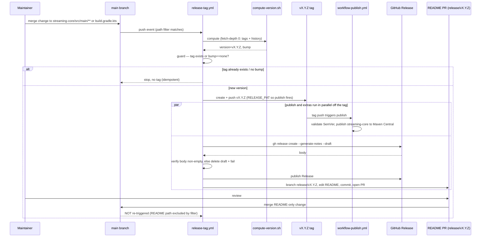

# Design Document

## Overview

The Release_Pipeline is new GitHub Actions automation that sits **upstream** of the existing `workflow-publish.yml`. It never publishes. Its job is to turn a merge into `main` that touches the published library into: a pushed `vX.Y.Z` tag, a GitHub Release with generated notes, and a reviewable README-update PR.

The handoff to the existing world is a single event: **pushing a `vX.Y.Z` tag**. That tag push is what fires `workflow-publish.yml` (unchanged). The Release_Pipeline's responsibility ends at producing the tag, the Release, and the PR.

Grounding facts verified in this repo:

- `workflow-publish.yml` triggers on `push` of tags `v*`, validates strict `^v(0|[1-9]\d*)\.(0|[1-9]\d*)\.(0|[1-9]\d*)$`, derives `RELEASE_VERSION` from the tag, publishes `streaming-core`. **Do not modify.**
- `ci-main-build.yml` runs on push to `main` (with `paths-ignore: ['**.md','docs/**','.kiro/**']`) and on `pull_request` to `main` (no paths-ignore, so every PR reports the required check).
- `workflow-build.yml` (reusable) is `permissions: contents: read`, checkout `fetch-depth: 0`.
- `README.md` carries the single hardcoded version under `## Dependency`: `implementation("nl.vintik:aws-lambda-streaming-core:2.1.0")`.
- Version is **not** in `gradle.properties` — the tag is the single source of truth.
- `dependabot.yml` groups all updates with commit-message `prefix: chore` + `include: scope`, so Dependabot commits read `chore(deps): ...` / `chore(deps-dev): ...`.

## Topology Decision: Two Workflows

**Recommendation: two workflows.**

### Workflow A — `release-tag.yml` (push to `main`, path-filtered)

```yaml
on:
  push:
    branches: [main]
    paths:
      - 'streaming-core/src/main/**'
      - 'streaming-core/build.gradle.kts'
```

Responsibilities: compute the next version, guard against an existing tag, create and push the tag. **This is the only workflow that reacts to library changes** (Req 1, 2, 3).

### Workflow B — `release-publish-extras.yml` (push tags `v*`)

```yaml
on:
  push:
    tags: ['v*']
```

Responsibilities: create the GitHub Release with generated notes (Req 4) and open the README PR on `release/vX.Y.Z` (Req 5). It fires on the same tag push that Workflow A creates.

### The parallelism call-out (important)

The existing `workflow-publish.yml` **also** triggers on `push` tags `v*`. So when Workflow A pushes the tag, **two** tag-triggered runs start **in parallel**:

```
tag push  ─┬─▶ workflow-publish.yml      (publishes to Maven Central — existing, untouched)
           └─▶ release-publish-extras.yml (Release notes + README PR — new)
```

These are independent and must stay independent. Publishing to Maven Central and creating a GitHub Release / README PR have no ordering dependency on each other; both only depend on the tag existing. Running them as two separate tag-triggered workflows keeps the publish workflow single-purpose and avoids coupling the new logic into a file we were told not to touch.

### Alternatives weighed

**Alternative 1 — single workflow does everything after computing the tag.** One `release-tag.yml` on push-to-main computes the version, pushes the tag, then (same run) creates the Release and opens the README PR; `workflow-publish.yml` still fires in parallel off the tag push.

- Pro: no reliance on a second tag-triggered run; the Release + PR are guaranteed to run in the same job that already proved the tag was created, so there is no "tag pushed but extras workflow didn't start" gap.
- Pro: simpler mental model and one place to read logs.
- Con: the Release/PR steps don't fire for tags pushed by a human by hand (only for pipeline-computed tags). For this repo that is acceptable — the pipeline is meant to be the only tagging path.

**Alternative 2 — two workflows (A: tag, B: tag-triggered extras).**

- Pro: Release/PR are produced for **any** `vX.Y.Z` tag however it was created, matching how `workflow-publish.yml` already behaves (symmetry).
- Con: relies on a second tag-triggered run actually starting; and a `GITHUB_TOKEN`-pushed tag does **not** trigger `on: push` tag workflows (see note below), which would break Workflow B entirely unless the tag is pushed with a Release_PAT.

**Chosen design: single workflow for the tag + extras (Alternative 1 shape), with the publish workflow left as the only separate tag-triggered consumer.** Concretely:

- `release-tag.yml` (push to main, path-filtered): compute → guard → push tag → create Release → open README PR, all in one run.
- `workflow-publish.yml` (unchanged): fires off the pushed tag, publishes.

This avoids the fragile "second workflow must re-trigger off the tag" dependency and the `GITHUB_TOKEN`-tag-does-not-trigger trap, while still letting publish run in parallel off the tag. The rest of this document describes `release-tag.yml` as a single multi-job workflow with explicit `needs:` ordering (Req 8).

> Rationale tie-break: the steering/requirements emphasise idempotency and not leaving half-done releases. A single run that owns "tag → Release → PR" with `needs:` ordering is easier to reason about for "did everything happen?" than two runs connected only by a tag event.

## Architecture

`release-tag.yml` is three jobs, strictly ordered with `needs:`:

```
job: compute      (permissions: contents: read)
    └─ outputs: version=vX.Y.Z, bump=major|minor|patch, exists=true|false
job: tag          (needs: compute, if exists==false; permissions: contents: write)
    └─ creates + pushes vX.Y.Z, creates GitHub Release
job: readme-pr    (needs: tag; permissions: contents: write, pull-requests: write)
    └─ branch release/vX.Y.Z, edit README, commit, open PR
```

Per-job least-privilege permissions (Req 7): `compute` is read-only; only `tag` and `readme-pr` escalate, and only to what they need.

The version computation is a small **bash script** checked into the repo (`scripts/release/compute-version.sh`), invoked by the `compute` job. See "Shell vs Gradle" below.

## Components and Interfaces

| Component | File | Responsibility | Requirements |
|---|---|---|---|
| Trigger / path filter | `release-tag.yml` `on.push.paths` | React only to `Library_Source_Paths` | 1, 6 |
| Version computer | `scripts/release/compute-version.sh` | Latest tag → aggregate commits → bump → next `vX.Y.Z` | 2 |
| Tag guard | `tag` job step | Stop if computed tag already exists | 3.4 |
| Tag creator | `tag` job | Create + push `vX.Y.Z` | 3.1, 3.2 |
| Release creator | `tag` job | `gh release create --generate-notes` + non-empty verify | 4, 8.1, 8.4 |
| README editor | `scripts/release/update-readme-version.sh` | Replace trailing version on the coordinate line | 5.2, 8.3 |
| PR opener | `readme-pr` job | Branch + commit + `gh pr create` | 5.1, 5.3, 5.4, 8.2 |

## Version Computation

### Shell vs Gradle

Steering explicitly allows a shell script for CI version computation. The computation is pure git/text work — list tags, enumerate commit subjects, classify prefixes, pick the max bump. A Gradle task would require booting the JVM/Gradle daemon on every push just to read `git log`, which is heavier and slower for no benefit. **Shell (POSIX/bash) is the right tool here.** It stays independently unit-testable (see Testing) and keeps the `compute` job free of JDK/Gradle setup.

### Algorithm (`compute-version.sh`)

Inputs: full history + tags (`fetch-depth: 0`). Output (to `$GITHUB_OUTPUT`): `version`, `bump`, `exists`.

```bash
#!/usr/bin/env bash
set -euo pipefail

# 1. Latest tag. Strict vMAJOR.MINOR.PATCH only, newest by version order.
latest="$(git tag --list 'v*' --sort=-v:refname \
  | grep -E '^v(0|[1-9][0-9]*)\.(0|[1-9][0-9]*)\.(0|[1-9][0-9]*)$' \
  | head -n1 || true)"

# 2. No prior tag -> Initial_Version (Req 2.5). Still guard for existence later.
if [ -z "$latest" ]; then
  echo "version=v1.0.0"; echo "bump=initial"; exit 0   # written to $GITHUB_OUTPUT
fi

# 3. Enumerate commits since latest tag. %s subject + %b body to catch BREAKING CHANGE footer.
range="${latest}..HEAD"

major=0; minor=0; patch=0
# Read each commit's subject and full body, separated by a NUL-ish sentinel.
while IFS= read -r line; do
  case "$line" in
    # feat!: / fix!: / refactor!: ... any type with a bang before the colon  -> major
    *"!"*:*) type_bang="${line%%:*}"; case "$type_bang" in *"!") major=1;; esac ;;
  esac
  case "$line" in
    "BREAKING CHANGE:"*|*$'\n'"BREAKING CHANGE:"*) major=1 ;;
    feat\(*\):*|feat:*)                             minor=1 ;;
    fix\(*\):*|fix:*)                               patch=1 ;;
    # Dependabot scopes -> patch (see "Dependabot bump rule" below)
    chore\(deps\):*|chore\(deps-dev\):*|build\(deps\):*|build\(deps-dev\):*) patch=1 ;;
  esac
done < <(git log --no-merges --format='%s%n%b' "$range")
# Note: BREAKING CHANGE in a body is matched by scanning the full %b too; see test fixtures.

# 4. Max-severity precedence: major > minor > patch (Req 2.7).
IFS='.' read -r cur_major cur_minor cur_patch <<< "${latest#v}"
if   [ "$major" = 1 ]; then next="v$((cur_major+1)).0.0";              bump=major
elif [ "$minor" = 1 ]; then next="v${cur_major}.$((cur_minor+1)).0";   bump=minor
elif [ "$patch" = 1 ]; then next="v${cur_major}.${cur_minor}.$((cur_patch+1))"; bump=patch
else next=""; bump=none   # nothing bumpable in the aggregate set
fi
```

Parsing rules, aligned to requirements:

- **Major** (Req 2.2): any commit whose type carries `!` before the colon (`feat!:`, `fix!:`, `refactor!:` …) **or** a `BREAKING CHANGE:` footer in the body.
- **Minor** (Req 2.3): any `feat:` / `feat(scope):` and no major present.
- **Patch** (Req 2.4): any `fix:` / `fix(scope):` and no minor/major present.
- **Aggregate set** (Req 2.6, 2.7): every non-merge commit in `latest..HEAD` is classified, including Dependabot commits, then the **highest** bump wins (`major > minor > patch`).
- **Initial** (Req 2.5): no prior strict tag → `v1.0.0`.
- **Output form** (Req 2.8): always `vMAJOR.MINOR.PATCH`.

### Dependabot bump rule (resolving the Req 2 contradiction)

**The contradiction:** `dependabot.yml` uses `commit-message.prefix: chore` + `include: scope`, so dependency upgrades arrive as `chore(deps): ...` / `chore(deps-dev): ...` (and the development variant). Under strict Conventional Commits, `chore` maps to **no bump** — but Req 2 wants dependency upgrades to be able to cut a release, and Req 2.6/2.7 require Dependabot commits to be treated identically to all others under the standard rules.

**Two options:**

1. **Treat `chore(deps)` / `chore(deps-dev)` / `build(deps)` scopes as a patch bump** in `compute-version.sh`. No change to the working Dependabot config.
2. **Change Dependabot's `commit-message.prefix`** to `fix` (or `build`) so upgrades map to a bump under vanilla rules.

**Recommendation: Option 1 (lower risk).** Deriving a patch bump from the `deps`/`deps-dev` scope keeps the working, GitHub-validated `dependabot.yml` untouched (recall its header comments document a prior invalid-config rejection — minimising edits there is deliberately safe). The rule lives in one place (the version script) and is unit-testable.

**Tradeoff / cost of Option 1:** the release pipeline now encodes a repo-specific convention (`chore(deps)` → patch) that is **not** standard Conventional Commits, so a reader of the script must know it. It is documented inline in the script and in `docs/log.md`. A hand-written `chore:` with no `deps`/`deps-dev` scope still correctly maps to no bump, so only dependency-scoped chores are promoted — matching Req 2's intent that dependency upgrades cut a (patch) release. This gotcha (chore→no-bump vs the deps-scope promotion) is recorded in `docs/log.md`.

## Data Models

The pipeline carries a small set of typed values between jobs rather than persistent data structures. These are the models that flow through `release-tag.yml`:

| Model | Shape | Produced by | Consumed by |
|---|---|---|---|
| `version` | string, strict `vMAJOR.MINOR.PATCH` (e.g. `v2.2.0`) | `compute` job (`compute-version.sh`) | `tag`, `readme-pr` jobs |
| `bump` | enum: `major` \| `minor` \| `patch` \| `initial` \| `none` | `compute` job | `tag` job (gate: skip when `none`) |
| `exists` | boolean | `tag` job guard (`git rev-parse`) | `tag` job (skip create/push when true) |
| `README_Artifact_Version` | the trailing `X.Y.Z` of the coordinate `nl.vintik:aws-lambda-streaming-core:X.Y.Z` in `README.md` | `update-readme-version.sh` | the README PR |
| `Release body` | GitHub-generated notes string, must be non-empty | `gh release create --generate-notes` | published Release |

All inter-job values are passed via `$GITHUB_OUTPUT`; none are persisted beyond the workflow run except the tag, the Release, and the PR branch.

## Idempotency / Guard

- The `compute` job and `tag` job run with `fetch-depth: 0` so **all tags and full history** are present (without it, `git tag --list` and `latest..HEAD` are unreliable).
- Guard (Req 3.4): after computing `version`, the `tag` job checks `git rev-parse -q --verify "refs/tags/$version"`. If the tag already exists (or `bump == none`), the job stops **before** creating or pushing anything — no tag, no Release, no PR. This makes re-runs safe: a replayed push computes the same version, sees the tag, and no-ops.

## Release Notes Failure Handling (Req 4.4)

Create the Release **as a draft first**, verify the body is non-empty, then publish:

```bash
# 1. Create draft with generated notes attached to the tag.
gh release create "$version" --generate-notes --draft --title "$version"

# 2. Fetch the generated body and verify it is non-empty.
body="$(gh release view "$version" --json body --jq '.body')"
if [ -z "${body//[[:space:]]/}" ]; then
  echo "::error::generated release notes are empty for $version"
  gh release delete "$version" --yes --cleanup-tag=false   # keep the tag; publish ran off it
  exit 1
fi

# 3. Publish only after the body is confirmed non-empty.
gh release edit "$version" --draft=false
```

This guarantees we never leave a **published** Release with a missing/empty body (Req 4.4). The draft approach is preferred over "create then inspect a live release" because a draft is not visible to consumers while being validated. We delete only the draft Release on failure — the tag stays (publish already consumed it), and the maintainer can add notes manually. No `CHANGELOG.md` is created or committed (Req 4.3).

## README PR Mechanics

### The edit (`update-readme-version.sh`)

Anchor on the coordinate, replace only the trailing version — never a blind line-number edit:

```bash
version_no_v="${version#v}"
# Match the coordinate, capture everything up to and including the final ':', swap the version.
sed -E -i.bak \
  's#(nl\.vintik:aws-lambda-streaming-core:)[0-9]+\.[0-9]+\.[0-9]+#\1'"${version_no_v}"'#' \
  README.md
rm -f README.md.bak
# Fail loudly if nothing changed (coordinate moved/renamed).
git diff --quiet -- README.md && { echo "::error::README version anchor not found"; exit 1; }
```

Anchoring on `nl.vintik:aws-lambda-streaming-core:` is resilient to the line moving; the trailing `X.Y.Z` is the only thing replaced (Req 5.2, 8.3).

### Branch + PR

```bash
branch="release/${version}"
git switch -c "$branch"
git commit -am "chore: update README dependency version to ${version_no_v}"
git push origin "$branch"
gh pr create --base main --head "$branch" \
  --title "docs: README version ${version}" \
  --body "Automated README dependency-version bump for ${version}. Docs-only; does not re-trigger a release."
```

(Req 5.1, 5.3, 5.4.) Note the commit message is `chore:` with **no** `deps` scope and is a **README-only** change, so even on merge it carries no bump and — more importantly — doesn't touch a trigger path.

### Loop guard (Req 6)

The README PR edits only `README.md`. The `release-tag.yml` trigger is `paths: [streaming-core/src/main/**, streaming-core/build.gradle.kts]`. A README-only merge touches **neither** path, so the path filter excludes it and no release run starts (Req 6.1, 6.2). This is a structural guarantee from the trigger, not a runtime check — the strongest kind.

### Branch protection + Release_PAT (Req 7.3)

**The trap, stated plainly:** a PR opened by a workflow using the default `GITHUB_TOKEN` does **not** trigger `on: pull_request` workflows. GitHub suppresses that event to prevent recursive workflow runs. So if branch protection on `main` requires `ci-main-build.yml`'s PR check, a `GITHUB_TOKEN`-opened README PR will show the required check as **never reported** → the PR is unmergeable without admin override.

Same mechanism matters for tags: a tag pushed with `GITHUB_TOKEN` does **not** trigger `on: push` tag workflows. In the chosen single-workflow design this does **not** break us for the Release (we create it in-run, not via a tag-triggered workflow), **but** it means `workflow-publish.yml` would not fire for a `GITHUB_TOKEN`-pushed tag. Therefore **the tag push must use the Release_PAT** for publish to trigger.

**Design:**

- Both the tag push and the PR creation read an optional `secrets.RELEASE_PAT`, falling back to `GITHUB_TOKEN`:
  ```yaml
  - uses: actions/checkout@v4
    with:
      fetch-depth: 0
      token: ${{ secrets.RELEASE_PAT || secrets.GITHUB_TOKEN }}
  ```
  and `GH_TOKEN: ${{ secrets.RELEASE_PAT || secrets.GITHUB_TOKEN }}` for `gh`.
- `contents: write` (Req 7.1) for tags/branches/Release; `pull-requests: write` (Req 7.2) for the PR.
- Using `GITHUB_TOKEN` remains acceptable (Req 7.3): the pipeline still produces the tag, Release, and PR; the only degradation is that `workflow-publish.yml` won't auto-fire and the README PR's required checks won't auto-run. The Release_PAT is used **only when explicitly configured**.

> Document in `docs/log.md`: "GITHUB_TOKEN-pushed tags do not trigger tag workflows, and GITHUB_TOKEN-opened PRs do not trigger pull_request workflows — configure RELEASE_PAT for publish auto-fire and required-check re-trigger."

## Error Handling

- `set -euo pipefail` in every script step; fail fast on git/`gh` errors.
- Never echo `RELEASE_PAT` / `GITHUB_TOKEN` / Maven/GPG secrets. Tokens flow only through `env`/`with.token`; the version script handles no secrets.
- Least-privilege per-job permissions (Req 7): `compute` read-only; `tag`/`readme-pr` escalate narrowly.
- The tag guard prevents duplicate/overwritten tags; the draft-then-verify prevents empty published Releases.
- `--no-merges` in `git log` avoids double-counting merge commits.

## Correctness Properties

These universal properties hold for any input and are what the test layers assert.

### Property 1: Max-severity bump
For any aggregate commit set since the latest tag, the computed `bump` equals the highest-precedence classification present (`major > minor > patch`), independent of commit order or count.

**Validates: Requirements 2.6, 2.7**

### Property 2: Strict output form
The computed `version` always matches `^v(0|[1-9][0-9]*)\.(0|[1-9][0-9]*)\.(0|[1-9][0-9]*)$`.

**Validates: Requirements 2.8**

### Property 3: Monotonic increase
The computed `version` is strictly greater (SemVer order) than the latest existing tag, or is the `Initial_Version` when none exists.

**Validates: Requirements 2.1, 2.5**

### Property 4: README round-trip
After `update-readme-version.sh` runs for `vX.Y.Z`, the coordinate line parses back to exactly `nl.vintik:aws-lambda-streaming-core:X.Y.Z`, and exactly one line changes.

**Validates: Requirements 5.2, 8.3**

### Property 5: Idempotency
Replaying the same push yields the same computed version; if that tag already exists the pipeline no-ops (no tag, Release, or PR).

**Validates: Requirements 3.4**

### Property 6: Loop exclusion
A change set touching only `README.md` matches neither trigger path, so it can never start a release run.

**Validates: Requirements 6.1, 6.2**

### Property 7: No empty Release
A published GitHub Release always has a non-empty body; an empty generated body fails the step with no published Release left behind.

**Validates: Requirements 4.4**

## Testing Strategy

Mirroring steering's testing norms (layered; cheap unit tests over live runs; property-style parameterized cases where a universal rule exists):

### 1. Version computation — unit-test the shell script

`compute-version.sh` is pure given a tag + a commit list, so test it directly (e.g. `bats`, or a plain bash harness invoked from a Gradle `exec`/CI step) over curated commit sets:

- `feat:` only → minor; `fix:` only → patch; `feat!:` → major; `BREAKING CHANGE:` footer → major.
- Mixed set `{fix:, feat:, chore(deps):}` → **minor** (max precedence).
- Mixed set `{fix:, feat!:}` → **major**.
- `chore(deps):` only → **patch** (Dependabot rule); plain `chore:` only → **none**.
- No prior tag → `v1.0.0`.
- Existing tag `v2.1.0` + `fix:` → `v2.1.1`; + `feat:` → `v2.2.0`; + `feat!:` → `v3.0.0`.
- This is a natural property set: *for any* aggregate commit set, output bump = max precedence of per-commit classifications. Use 10–20 diverse fixtures.

### 2. README edit — unit-test `update-readme-version.sh`

- *For any* version `vX.Y.Z`, running the script leaves exactly one changed line and the coordinate line equals `nl.vintik:aws-lambda-streaming-core:X.Y.Z` (round-trip: parse the version back out of the edited line).
- Anchor-missing fixture (renamed coordinate) → script exits non-zero.

### 3. Path filter + loop guard — static assertion

- Assert `release-tag.yml`'s `on.push.paths` is exactly the two library paths (a `yq`/grep check in CI), proving docs/example/tooling pushes don't trigger (Req 1) and a README-only merge can't (Req 6).

### 4. Release-notes guard — logic test

- Simulate empty generated notes (mock `gh release view` body = whitespace) → the step exits non-zero and the draft is deleted; non-empty body → publishes. Validated without a live release by factoring the verify logic into a small testable function.

Full end-to-end (real tag → real publish ∥ real Release + PR) is proven once against the live repo, mirroring how streaming is only fully proven post-deploy. The unit layers above cover everything that varies with input without a live release.

## End-to-End Flow



## Requirements Traceability

| Design section | Requirements |
|---|---|
| Topology Decision (two consumers of the tag; single release workflow) | 1, 3, 4, 5, 8 |
| Trigger / path filter | 1.1, 1.2, 1.3 |
| Version Computation (algorithm) | 2.1, 2.2, 2.3, 2.4, 2.5, 2.8 |
| Dependabot bump rule | 2.6, 2.7 |
| Idempotency / Guard | 3.4 |
| Tag creator (`tag` job) | 3.1, 3.2; 3.3 (never publishes) |
| Release Notes Failure Handling | 4.1, 4.2, 4.3, 4.4, 8.1, 8.4 |
| README PR Mechanics (edit) | 5.2, 8.3 |
| README PR Mechanics (branch + PR) | 5.1, 5.3, 5.4, 8.2 |
| Loop guard | 6.1, 6.2 |
| Branch protection + Release_PAT; per-job permissions | 7.1, 7.2, 7.3 |
| Architecture (job ordering via `needs:`) | 8.1, 8.2 |
| Error Handling & Security | 3.3, 4.4, 7 |
| Testing | 1, 2, 4, 6 (validation of) |
