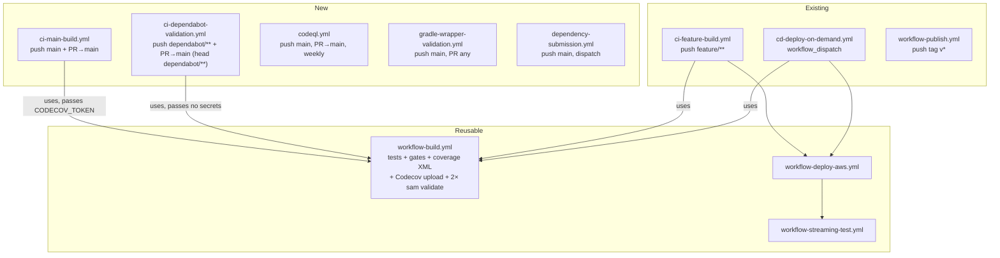

# Design Document

## Overview

This feature adds the quality-signal and dependency-automation layer to `aws-lambda-streaming-jvm-runtime`. It ships no application code. Every artefact is a README fragment, a GitHub Actions workflow, a tool configuration file, a Gradle version catalog, or a markdown document.

The work splits into five blocks that depend on each other in this order:

1. **Signal creation** — the repository currently produces none of the data three of the eight badges need. A `main`-branch CI workflow, machine-readable coverage XML for all three modules, and CodeQL analysis have to exist before the badges pointing at them mean anything.
2. **Dependabot resolvability** — dependency versions live in `extra["…"]` entries in the root `build.gradle.kts`, read through `rootProject.extra["…"]` string interpolation. Dependabot's Gradle parser reads literal coordinates, `gradle.properties` values and version catalogs; it does not evaluate Kotlin-DSL map lookups. Migrating to `gradle/libs.versions.toml` is a prerequisite for Dependabot doing anything at all.
3. **Automation** — Dependabot config, its validation pipeline, wrapper validation, dependency-graph submission.
4. **Presentation** — the eight-badge block, plus `SECURITY.md`, `CONTRIBUTING.md`, `CODE_OF_CONDUCT.md`, the community templates, and the maintainer setup checklist.
5. **Verification** — one script plus two Gradle tasks that prove the above is internally consistent before merge.

### Scope boundaries (settled, not reopened here)

| Excluded | Reason |
|---|---|
| OpenSSF Scorecard badge + `scorecard.yml` | Excluded by the requester. No mention anywhere in the deliverables. |
| OpenSSF Best Practices badge | Excluded by the requester. |
| OpenAPI / Swagger validity badge | This repository publishes no OpenAPI document. |
| semantic-release (`.releaserc.json`) | `workflow-publish.yml` triggers on `v*` tags and rejects anything that is not `vMAJOR.MINOR.PATCH`. MockNest's `tagFormat: "${version}"` would cut bare-semver tags that never trigger a publish. Releases stay manual. |
| Deploy on `main` push | Deploys stay on `cd-deploy-on-demand.yml`, keeping AWS cost and blast radius under manual control. |
| Dependabot auto-merge | CI validates; a human merges. Mirrors the reference repository. |

These exclusions are recorded once here and once in `SECURITY.md`'s tooling table (as "not used, and why"). They appear nowhere else.

### Research findings that shaped the design

- **Kover emits JaCoCo-schema XML.** Verified by generating both reports locally: `streaming-core/build/reports/kover/report.xml` and `streaming-s3-example-java/build/reports/jacoco/test/jacocoTestReport.xml` both use `<report><package><class><counter type="LINE" missed=".." covered="..">`. One parser and one Codecov file list handle all three modules. The JaCoCo file additionally carries a `<!DOCTYPE report PUBLIC … "report.dtd">` declaration, so any XML reader must have external DTD loading switched off.
- **`timeout-minutes` is not supported on a job that calls a reusable workflow.** Requirements 3.10 and 11.7 therefore cannot be satisfied in `ci-main-build.yml` or `ci-dependabot-validation.yml`; they are satisfied by declaring `timeout-minutes` on the jobs inside `workflow-build.yml`.
- **The `secrets` context is not available in `if:` expressions.** Requirement 5.9's "token absent → skip and log" cannot be written as `if: secrets.CODECOV_TOKEN != ''`. It needs a preceding step that maps the secret into `env` and emits a step output.
- **`pull_request` has no head-branch filter.** Requirement 11.1's "head branch matches `dependabot/**`" must be a job-level `if:` on `github.head_ref`.
- **`gradle/actions/wrapper-validation` has a `min-wrapper-count` input, default `1`** ([action definition](https://github.com/gradle/actions/blob/main/wrapper-validation/action.yml)), and exposes a `failed-wrapper` output listing offending paths. Requirements 7.4 and 7.5 are satisfied by the action itself; the input is declared explicitly so the intent is auditable.
- **`setup-gradle` v4+ already performs wrapper validation on every execution** ([Gradle docs](https://github.com/gradle/actions/blob/main/docs/wrapper-validation.md)). The dedicated workflow is still required, because Requirement 7.1 wants validation on changes that run no Gradle task at all, and Requirement 7.7 forbids invoking Gradle in that run.
- **CodeQL's Kotlin extractor is pinned to specific Kotlin versions and hard-fails on unsupported ones.** Since [CodeQL CLI 2.11.6](https://codeql.github.com/docs/codeql-overview/codeql-changelog/codeql-cli-2.11.6/) an unsupported Kotlin version fails extraction rather than silently skipping, and new Kotlin releases routinely outrun the bundle ([codeql-action#3793](https://github.com/github/codeql-action/issues/3793)). This repository is on Kotlin 2.3.0, so Requirement 6.7's contingency is a likely path, not a theoretical one. Content was rephrased for compliance with licensing restrictions.
- **Version catalog plugin aliases only work where the plugin is not already on the inherited script classpath.** The root declares four plugins with `apply false`; a subproject re-requesting them with a version fails with "Plugin request for plugin already on the classpath must not include a version". And `settings.gradle.kts` cannot see the catalog at all.

---

## Architecture

### Workflow topology



`codeql.yml`, `gradle-wrapper-validation.yml` and `dependency-submission.yml` are self-contained: they call no reusable workflow. CodeQL runs `./gradlew assemble` directly (build-mode `manual` needs the build inside the CodeQL init/analyze sandwich, which a reusable workflow cannot provide); wrapper validation runs no Gradle at all; dependency submission resolves dependencies through its own action.

`workflow-build.yml` is the single build definition. All four build-running workflows delegate to it; none duplicates its steps. `ci-main-build.yml` and `ci-dependabot-validation.yml` are deliberately thin: one job, one `uses:`, no deploy and no streaming-test stage.

### Complete workflow inventory

| Workflow | Status | Triggers | Calls | Gradle | Merge-gating into `main` |
|---|---|---|---|---|---|
| `ci-main-build.yml` | **new** | `push` main (`paths-ignore`), `pull_request` → main (`opened`/`reopened`/`synchronize`) | `workflow-build.yml` | via reusable | **Yes** — the Build_Badge check |
| `ci-dependabot-validation.yml` | **new** | `push` `dependabot/**`, `pull_request` → main where head is `dependabot/**` | `workflow-build.yml` | via reusable | Yes, on Dependabot PRs only |
| `codeql.yml` | **new** | `push` main, `pull_request` → main, weekly cron | — | `assemble` | Yes |
| `gradle-wrapper-validation.yml` | **new** | `push` main, `pull_request` (any base) | — | none (Req 7.7) | Yes |
| `dependency-submission.yml` | **new** | `push` main, `workflow_dispatch` | — | dependency resolution only | No (post-merge) |
| `workflow-build.yml` | **changed** | `workflow_call` | — | coverage invocation + 2× `sam validate` | n/a (reusable) |
| `ci-feature-build.yml` | unchanged | `push` `feature/**` | build → deploy → streaming-test | via reusable | No |
| `cd-deploy-on-demand.yml` | unchanged | `workflow_dispatch` | build → deploy → streaming-test | via reusable | No |
| `workflow-deploy-aws.yml` | unchanged | `workflow_call` | — | `:module:build` | No |
| `workflow-streaming-test.yml` | unchanged | `workflow_call` | — | none | No |
| `workflow-publish.yml` | unchanged | `push` tag `v*` | — | `publishAndReleaseToMavenCentral` | No |

Overlap is intentional and bounded: a human PR into `main` triggers `ci-main-build.yml`, `codeql.yml` and `gradle-wrapper-validation.yml`, while `ci-dependabot-validation.yml`'s single job is skipped by its `if:`. A Dependabot PR triggers all four, with the Dependabot workflow's concurrency key collapsing the `push` and `pull_request` runs into one.

### Action pinning policy

New workflows pin to the same action majors the repository already uses — `actions/checkout@v4`, `actions/setup-java@v4`, `gradle/actions/*@v4` — plus `github/codeql-action/*@v3` and `codecov/codecov-action@v5`. No floating branch references. Newer majors exist (`gradle/actions@v6`, `codecov-action@v7`); deliberately not adopted in this change, because Dependabot's `github-actions` ecosystem proposing exactly those bumps in its first pull request is the cheapest end-to-end proof that the Dependabot path works.

---

## Components and Interfaces

### 1. Badge block (`README.md`)

The README's title is `# aws-lambda-streaming-core`. The block is inserted directly beneath it, with one blank line either side, and nothing else between the title and the block. The first prose paragraph ("A JVM library that implements…") follows unchanged.

The literal eight lines, in order, five status badges then a blank line then three language badges:

```markdown
[](https://github.com/elenavanengelenmaslova/aws-lambda-streaming-jvm-runtime/releases/latest)
[](https://central.sonatype.com/artifact/nl.vintik/aws-lambda-streaming-core)
[](https://github.com/elenavanengelenmaslova/aws-lambda-streaming-jvm-runtime/actions/workflows/ci-main-build.yml)
[](https://codecov.io/gh/elenavanengelenmaslova/aws-lambda-streaming-jvm-runtime)
[](https://github.com/elenavanengelenmaslova/aws-lambda-streaming-jvm-runtime/security/code-scanning)

[](https://kotlinlang.org)
[](https://openjdk.org)
[](https://opensource.org/licenses/MIT)
```

Every label is 1–40 characters and names its signal. Every badge is an image inside a link; no bare images, no inline HTML. No excluded badge appears, rendered or commented out.

The JVM badge says **21**, not 25: Requirement 12.2 ties it to the published `streaming-core` module, whose toolchain is `JavaLanguageVersion.of(21)` and whose `jvmTarget` is `JVM_21`. The example modules' Java 25 is not a consumer-facing floor and is not advertised.

Requirement 14.8's links to `SECURITY.md` and `CONTRIBUTING.md` are a **separate edit in the same pull request**, placed in a new "Contributing and security" section immediately before `## License`. They cannot sit near the top without violating Requirement 1.1's "no other content between the title and the Badge_Block".

### 2. Version catalog migration

#### The 15 `extra` entries being migrated

| `extra` key | Value | Consumers | Catalog destination |
|---|---|---|---|
| `awsLambdaCoreVersion` | `1.4.0` | both example modules | `[versions] awsLambdaCore` |
| `awsLambdaEventsVersion` | `3.16.1` | **none** (declared, unused) | `[versions] awsLambdaEvents` |
| `awsSdkKotlinVersion` | `1.6.59` | kotlin example ×3 (s3, lambda, apigateway) | `[versions] awsSdkKotlin` |
| `kotlinxSerializationVersion` | `1.9.0` | all three modules | `[versions] kotlinxSerialization` |
| `kotlinLoggingVersion` | `7.0.7` | kotlin example | `[versions] kotlinLogging` |
| `cracVersion` | `1.5.0` | both example modules | `[versions] crac` |
| `junitVersion` | `6.0.0` | all three modules | `[versions] junit` |
| `mockkVersion` | `1.14.5` | core + kotlin example | `[versions] mockk` |
| `coroutinesVersion` | `1.10.2` | kotlin example ×2 (core, test) | `[versions] kotlinxCoroutines` |
| `testcontainersVersion` | `1.21.4` | both example modules ×2 | `[versions] testcontainers` |
| `flociTestcontainersVersion` | `1.14.0` | both example modules | `[versions] flociTestcontainers` |
| `flociImage` | `floci/floci:1.7.0` | both example modules (`systemProperty`) | `[versions] flociImage` = `1.7.0`, image name composed in the build file |
| `awsSdkJavaVersion` | `2.50.2` | java example (BOM) | `[versions] awsSdkJava` |
| `jacksonVersion` | `2.22.1` | java example | `[versions] jackson` |
| `mockitoVersion` | `5.23.0` | java example ×2 | `[versions] mockito` |

`awsLambdaEventsVersion` is unused by any module today (confirmed by search). It is carried into the catalog rather than dropped: Requirement 9.1 names all 15, and Requirement 9.3 demands zero resolved-dependency differences, which removing an unused declaration would technically satisfy but would make the migration diff carry a second, unrelated change. Removing it is a follow-up.

Six more version strings currently live as literals in build files and move to the catalog under Requirement 9.5/9.6:

| Literal | Location | Catalog destination |
|---|---|---|
| `2.3.0` (×2: `kotlin("jvm")`, `kotlin("plugin.serialization")`) | root `plugins` | `[versions] kotlin` |
| `9.0.2` (`com.gradleup.shadow`) | root `plugins` | `[versions] shadow` |
| `0.9.1` (`org.jetbrains.kotlinx.kover`) | root `plugins` | `[versions] kover` |
| `0.31.0` (`com.vanniktech.maven.publish`) | `streaming-core` `plugins` | `[versions] mavenPublish` |
| `0.18.1` (binary-compatibility-validator) | `streaming-core` `plugins` | `[versions] bcv` |
| `2.0.16` (`org.slf4j:slf4j-simple`, ×2) | both example modules | `[versions] slf4j` |
| `0.8.14` (`jacoco.toolVersion`) | java example | `[versions] jacoco` |

#### Target `gradle/libs.versions.toml`

```toml
# Single source of truth for every external dependency and plugin version.
# Declared here rather than in build.gradle.kts `extra[...]` entries because Dependabot's
# Gradle parser does not evaluate Kotlin-DSL map lookups. See docs/log.md.

[versions]
kotlin = "2.3.0"
shadow = "9.0.2"
kover = "0.9.1"
mavenPublish = "0.31.0"
bcv = "0.18.1"
jacoco = "0.8.14"

awsLambdaCore = "1.4.0"
awsLambdaEvents = "3.16.1"
awsSdkKotlin = "1.6.59"
awsSdkJava = "2.50.2"
kotlinxSerialization = "1.9.0"
kotlinxCoroutines = "1.10.2"
kotlinLogging = "7.0.7"
slf4j = "2.0.16"
jackson = "2.22.1"
crac = "1.5.0"

junit = "6.0.0"
mockk = "1.14.5"
mockito = "5.23.0"
testcontainers = "1.21.4"
flociTestcontainers = "1.14.0"
# Docker image tag for the Floci emulator, not a Maven coordinate — Dependabot cannot bump this.
flociImage = "1.7.0"

[libraries]
aws-lambda-core        = { module = "com.amazonaws:aws-lambda-java-core", version.ref = "awsLambdaCore" }
aws-lambda-events      = { module = "com.amazonaws:aws-lambda-java-events", version.ref = "awsLambdaEvents" }
aws-sdk-kotlin-s3         = { module = "aws.sdk.kotlin:s3", version.ref = "awsSdkKotlin" }
aws-sdk-kotlin-lambda     = { module = "aws.sdk.kotlin:lambda", version.ref = "awsSdkKotlin" }
aws-sdk-kotlin-apigateway = { module = "aws.sdk.kotlin:apigateway", version.ref = "awsSdkKotlin" }
aws-sdk-java-bom       = { module = "software.amazon.awssdk:bom", version.ref = "awsSdkJava" }
aws-sdk-java-s3        = { module = "software.amazon.awssdk:s3" }            # version from the BOM
kotlinx-serialization-json = { module = "org.jetbrains.kotlinx:kotlinx-serialization-json", version.ref = "kotlinxSerialization" }
kotlinx-coroutines-core    = { module = "org.jetbrains.kotlinx:kotlinx-coroutines-core", version.ref = "kotlinxCoroutines" }
kotlinx-coroutines-test    = { module = "org.jetbrains.kotlinx:kotlinx-coroutines-test", version.ref = "kotlinxCoroutines" }
kotlin-logging-jvm     = { module = "io.github.oshai:kotlin-logging-jvm", version.ref = "kotlinLogging" }
slf4j-simple           = { module = "org.slf4j:slf4j-simple", version.ref = "slf4j" }
jackson-databind       = { module = "com.fasterxml.jackson.core:jackson-databind", version.ref = "jackson" }
crac                   = { module = "org.crac:crac", version.ref = "crac" }

junit-jupiter          = { module = "org.junit.jupiter:junit-jupiter", version.ref = "junit" }
junit-platform-launcher = { module = "org.junit.platform:junit-platform-launcher" }  # version from junit-jupiter
mockk                  = { module = "io.mockk:mockk", version.ref = "mockk" }
mockito-core           = { module = "org.mockito:mockito-core", version.ref = "mockito" }
mockito-junit-jupiter  = { module = "org.mockito:mockito-junit-jupiter", version.ref = "mockito" }
testcontainers         = { module = "org.testcontainers:testcontainers", version.ref = "testcontainers" }
testcontainers-junit-jupiter = { module = "org.testcontainers:junit-jupiter", version.ref = "testcontainers" }
floci-testcontainers   = { module = "io.floci:testcontainers-floci", version.ref = "flociTestcontainers" }
# Never added to a configuration. Declared so Dependabot sees the JaCoCo coordinate and bumps the
# `jacoco` version entry that `jacoco.toolVersion` reads.
jacoco-agent           = { module = "org.jacoco:org.jacoco.agent", version.ref = "jacoco" }

[bundles]
# Both example modules take exactly these three for their Floci integration tests.
integration-testing = ["testcontainers", "testcontainers-junit-jupiter", "floci-testcontainers"]

[plugins]
kotlin-jvm    = { id = "org.jetbrains.kotlin.jvm", version.ref = "kotlin" }
kotlin-serialization = { id = "org.jetbrains.kotlin.plugin.serialization", version.ref = "kotlin" }
shadow        = { id = "com.gradleup.shadow", version.ref = "shadow" }
kover         = { id = "org.jetbrains.kotlinx.kover", version.ref = "kover" }
maven-publish = { id = "com.vanniktech.maven.publish", version.ref = "mavenPublish" }
bcv           = { id = "org.jetbrains.kotlinx.binary-compatibility-validator", version.ref = "bcv" }
```

Only one bundle is worth having. `integration-testing` is used identically by both example modules. Everything else is either single-use or module-specific, and a bundle would hide which module pulls what.

#### How plugin versions move

The root build script applies four plugins with `apply false` to put them on the classpath subprojects inherit:

```kotlin
plugins {
    alias(libs.plugins.kotlin.jvm) apply false
    alias(libs.plugins.kotlin.serialization) apply false
    alias(libs.plugins.shadow) apply false
    alias(libs.plugins.kover) apply false
}
```

`alias(...)` works in a build script's `plugins` block, so these four move cleanly. Subprojects must keep requesting them **without** a version (`kotlin("jvm")`, `id("com.gradleup.shadow")`, `id("org.jetbrains.kotlinx.kover")`) — switching them to `alias(...)` would re-introduce a version for a plugin already on the inherited classpath, which Gradle rejects. Only `streaming-core`'s two module-local plugins gain aliases, because the root never declares them:

```kotlin
plugins {
    kotlin("jvm")
    kotlin("plugin.serialization")
    id("org.jetbrains.kotlinx.kover")
    alias(libs.plugins.maven.publish)
    alias(libs.plugins.bcv)
}
```

`settings.gradle.kts` keeps `id("org.gradle.toolchains.foojay-resolver-convention") version "0.9.0"` as a literal: settings scripts have no catalog accessors. This is acceptable rather than merely unavoidable — Dependabot reads literal `version "…"` declarations fine. The catalog exists to remove *interpolated* versions and to keep shared versions (`awsSdkKotlin` used 3×, `junit` 3×, `testcontainers` 2×, `kotlinxCoroutines` 2×) as one entry, which inlining literals everywhere would fragment.

#### Non-Maven and versionless exceptions (Requirement 9.8)

| File | Value | Reason | Consequence |
|---|---|---|---|
| `settings.gradle.kts` | foojay-resolver `0.9.0` | Settings scripts cannot read the catalog | Stays Dependabot-visible as a literal |
| both example modules | `"floci/floci:${libs.versions.flociImage.get()}"` | The image *name* is not a version; the tag comes from the catalog | Dependabot cannot bump a Docker tag held in `[versions]` with no library referencing it — manual bump, logged |
| `streaming-core` | `version = providers.gradleProperty("releaseVersion")…` | The project's own version, derived from the git tag | Out of scope; must not be "migrated" |
| all three modules | `junit-platform-launcher` (no version) | Version constrained by `junit-jupiter` | None |
| java example | `aws-sdk-java-s3` (no version) | Version from `software.amazon.awssdk:bom` | None |

Each row is also recorded as a `docs/log.md` exception entry, and the same list is the allow-list the verification script uses, so an *undocumented* literal version in a build file fails the check.

#### Capturing the Version_Catalog_Baseline

A tree-walk of `./gradlew :module:dependencies` output is rejected: the tree renders conflict resolution as `1.8.0 -> 1.9.0`, and parsing that out of ASCII art is brittle enough to hide exactly the difference the baseline is meant to catch. Instead the root build script registers a task per module that prints resolved coordinates directly:

```kotlin
subprojects {
    // plugins.withId, not a bare subprojects{} body: the root script is evaluated before the
    // subprojects, so `configurations` is empty at that point.
    plugins.withId("java") {
        tasks.register("resolvedCoordinates") {
            group = "verification"
            description = "Writes resolved group:name:version per configuration, for baseline diffing."
            val configNames = listOf(
                "compileClasspath", "runtimeClasspath", "testCompileClasspath", "testRuntimeClasspath",
            )
            // rootComponent is a Provider, so this is configuration-cache safe.
            val roots = configNames.associateWith { name ->
                configurations.named(name).flatMap { it.incoming.resolutionResult.rootComponent }
            }
            val out = layout.buildDirectory.file("reports/resolved-coordinates/${project.name}.txt")
            outputs.file(out)
            doLast { /* walk each root, collect ModuleComponentIdentifier, sort, write "config  g:n:v" */ }
        }
    }
}
```

and `scripts/dependency-baseline.sh <label>` drives it:

```bash
./gradlew --quiet resolvedCoordinates -PexcludeTags=integration
mkdir -p "build/dependency-baseline/$1"
cp */build/reports/resolved-coordinates/*.txt "build/dependency-baseline/$1/"
```

Baseline procedure, run on the migration branch:

```bash
git stash                                   # pre-migration tree
./scripts/dependency-baseline.sh before
git stash pop                               # post-migration tree
./scripts/dependency-baseline.sh after
diff -ru build/dependency-baseline/before build/dependency-baseline/after   # must be empty
./gradlew :streaming-core:apiCheck                                          # dump unchanged
```

An empty diff plus a passing `apiCheck` is the proof the migration changed declaration form only.

### 3. Coverage aggregation

Verified report paths (produced locally by `./gradlew koverXmlReport jacocoTestReport -PexcludeTags=integration`):

| Module | Tool | Report task | XML path |
|---|---|---|---|
| `:streaming-core` | Kover 0.9.1 | `koverXmlReport` | `streaming-core/build/reports/kover/report.xml` |
| `:streaming-s3-example` | Kover 0.9.1 | `koverXmlReport` | `streaming-s3-example/build/reports/kover/report.xml` |
| `:streaming-s3-example-java` | JaCoCo 0.8.14 | `jacocoTestReport` | `streaming-s3-example-java/build/reports/jacoco/test/jacocoTestReport.xml` |

All three paths are Gradle defaults and are stable run to run. XML output is already enabled on `jacocoTestReport` (`xml.required.set(true)`), so Requirement 4.2 needs no build change.

**Decision: one root task, not a task list.** A root `verifyCoverageReports` task is added; CI runs exactly one invocation:

```bash
./gradlew verifyCoverageReports koverVerify koverHtmlReport -PexcludeTags=integration --continue
```

- `verifyCoverageReports` (root) `dependsOn` `:streaming-core:koverXmlReport`, `:streaming-s3-example:koverXmlReport`, `:streaming-s3-example-java:jacocoTestReport`, then asserts each of the three files exists, parses, contains at least one `<class>` element, and reports a non-zero LINE `covered` count — failing with the offending module named (Requirement 4.7). It also writes the three resolved paths to `build/reports/coverage-report-paths.txt` for the cross-file path check.
- `koverVerify` unqualified fans out to all three modules: 90% on `:streaming-core`, 80% on `:streaming-s3-example`, and on `:streaming-s3-example-java` the existing alias delegating to `jacocoTestCoverageVerification` at 80%. Gates unchanged (Requirement 4.4), alias names preserved (Requirement 4.5).
- `koverHtmlReport` unqualified produces HTML for all three (the Java module's alias resolves to `jacocoTestReport`, already in the graph).
- `--continue` is what makes Requirements 4.8 and 5.1 hold together: without it a failing gate aborts the build before the report tasks run, leaving Codecov nothing to upload. With it, reports are written and retained even when a gate fails.

The alternative — naming all three report tasks on the command line and doing the existence check in a shell step — was rejected because Requirement 4.7 says *the build* fails, and because a single named entry point cannot drift from the paths CI hardcodes.

XML parsing in `verifyCoverageReports` must disable external DTD loading; the JaCoCo report declares `report.dtd`, which is absent next to the XML and would make a default `DocumentBuilder` fail or reach out to the network.

### 4. Codecov wiring in `workflow-build.yml`

Declaration:

```yaml
on:
  workflow_call:
    inputs:
      aws-region: { … unchanged … }
    secrets:
      CODECOV_TOKEN:
        description: 'Codecov upload token. Omit on runs that cannot read repository secrets.'
        required: false
```

Inside the existing `test` job, `timeout-minutes: 30` is added to the job (this is where Requirements 3.10 and 11.7 land), and three steps replace the current coverage step:

```yaml
      - name: Run tests with coverage
        run: ./gradlew verifyCoverageReports koverVerify koverHtmlReport -PexcludeTags=integration --continue

      - name: Determine coverage-upload eligibility
        id: cov
        if: ${{ !cancelled() && github.event_name == 'push' && github.ref == 'refs/heads/main' }}
        env:
          CODECOV_TOKEN: ${{ secrets.CODECOV_TOKEN }}
        run: |
          set -uo pipefail
          missing=0
          for f in streaming-core/build/reports/kover/report.xml \
                   streaming-s3-example/build/reports/kover/report.xml \
                   streaming-s3-example-java/build/reports/jacoco/test/jacocoTestReport.xml; do
            [ -s "$f" ] || { echo "::error::coverage report missing or empty: $f"; missing=1; }
          done
          if [ -z "${CODECOV_TOKEN:-}" ]; then
            echo "::notice::Coverage publishing skipped — no CODECOV_TOKEN available (maintainer setup checklist item 2)."
            echo "eligible=false" >> "$GITHUB_OUTPUT"
          else
            echo "eligible=true" >> "$GITHUB_OUTPUT"
          fi
          echo "reports-missing=$missing" >> "$GITHUB_OUTPUT"

      - name: Upload coverage to Codecov
        if: ${{ !cancelled() && steps.cov.outputs.eligible == 'true' }}
        uses: codecov/codecov-action@v5
        timeout-minutes: 10
        continue-on-error: true
        with:
          token: ${{ secrets.CODECOV_TOKEN }}
          files: >-
            streaming-core/build/reports/kover/report.xml,
            streaming-s3-example/build/reports/kover/report.xml,
            streaming-s3-example-java/build/reports/jacoco/test/jacocoTestReport.xml
          fail_ci_if_error: true
```

Why each piece:

- **`!cancelled()` rather than `success()`** — Requirement 5.1 wants the upload attempted whether or not the gates passed. `!cancelled()` also keeps a cancelled run from uploading partial data.
- **The eligibility step exists at all** because the `secrets` context is unavailable in `if:`. Mapping the token into `env` and emitting a step output is the only way to express Requirement 5.9's "token absent → skip and say so". The token value itself is never echoed.
- **`continue-on-error: true` with `fail_ci_if_error: true`** — the combination Requirements 5.5 and 5.10 describe: the step is marked failed and the error is in the log, but the job conclusion stays owned by the tests, the gates and `sam validate`.
- **`timeout-minutes: 10`** bounds the upload per Requirement 5.5.
- **Branch condition on the eligibility step** means pull-request runs, Dependabot runs, Dependabot branch pushes and feature-branch pushes never reach the token they cannot read.

`codecov.yml` at the repository root:

```yaml
codecov:
  require_ci_to_pass: true

coverage:
  precision: 2
  round: down
  status:
    project:
      default:
        # 80% matches the LOWEST per-module gate in the repository (the two example modules).
        # :streaming-core is gated at 90% by koverVerify; that stricter gate stays the build's
        # responsibility, not Codecov's, so a single aggregate target cannot be set to 90%.
        target: 80%
        threshold: 1%
    patch:
      default:
        target: 80%

ignore:
  - "**/test/**"
  - "**/build/**"
  - "**/bin/**"
  - "deployment/**"
```

Caller obligations:

| Caller | `secrets:` passed |
|---|---|
| `ci-main-build.yml` | `CODECOV_TOKEN: ${{ secrets.CODECOV_TOKEN }}` |
| `ci-dependabot-validation.yml` | **none** — Requirement 11.3 forbids any `secrets` reference |
| `ci-feature-build.yml` | none (unchanged) |
| `cd-deploy-on-demand.yml` | none (unchanged) |

`required: false` is what lets the three non-passing callers stay untouched. `secrets: inherit` is not used anywhere.

### 5. `ci-main-build.yml`

```yaml
name: CI - Main Build
on:
  push:
    branches: [main]
    paths-ignore: ['**.md', 'docs/**', '.kiro/**']
  pull_request:
    branches: [main]
    types: [opened, reopened, synchronize]
permissions:
  contents: read
concurrency:
  group: ${{ github.workflow }}-${{ github.ref }}
  cancel-in-progress: true
jobs:
  build:
    uses: ./.github/workflows/workflow-build.yml
    with:
      aws-region: 'eu-west-1'
    secrets:
      CODECOV_TOKEN: ${{ secrets.CODECOV_TOKEN }}
```

`paths-ignore` is on `push` only. Putting it on `pull_request` would make a documentation-only PR never report the check, and a required check that never reports blocks the merge forever — the opposite of the intent. One job, one `uses:`, no deploy or streaming-test reference. The 30-minute bound lives on `workflow-build.yml`'s jobs.

### 6. `ci-dependabot-validation.yml`

```yaml
name: CI - Dependabot Validation
on:
  push:
    branches: ['dependabot/**']
  pull_request:
    branches: [main]
permissions:
  contents: read
concurrency:
  # head_ref on pull_request, ref_name on push — both resolve to the dependabot branch name, so
  # the two events for one branch share a group instead of racing.
  group: ${{ github.workflow }}-${{ github.head_ref || github.ref_name }}
  cancel-in-progress: true
jobs:
  build:
    if: ${{ github.event_name == 'push' || startsWith(github.head_ref, 'dependabot/') }}
    uses: ./.github/workflows/workflow-build.yml
```

No `secrets:` block and no `secrets` token anywhere in the file, so a Dependabot run — read-only token, separate secrets store — passes whenever the build passes. The `if:` is the substitute for the head-branch filter `pull_request` does not offer; on human PRs the job is skipped rather than run.

### 7. `codeql.yml`

```yaml
name: CI - CodeQL
on:
  push:
    branches: [main]
  pull_request:
    branches: [main]
  schedule:
    - cron: '17 4 * * 1'      # Mondays 04:17 UTC, ahead of Dependabot's Monday 06:00 UTC run
permissions:
  contents: read
jobs:
  analyze:
    name: Analyze (${{ matrix.language }})
    runs-on: ubuntu-latest
    timeout-minutes: 60
    permissions:
      security-events: write
      contents: read
      actions: read
      packages: read
    strategy:
      fail-fast: false
      matrix:
        include:
          - language: java-kotlin
            build-mode: manual
          - language: actions
            build-mode: none
    steps:
      - uses: actions/checkout@v4
      - uses: actions/setup-java@v4
        with:
          distribution: temurin
          java-version: '25'
      - uses: gradle/actions/setup-gradle@v4
      - uses: github/codeql-action/init@v3
        with:
          languages: ${{ matrix.language }}
          build-mode: ${{ matrix.build-mode }}
      - name: Build all modules for extraction
        if: matrix.build-mode == 'manual'
        run: ./gradlew assemble --stacktrace
      - uses: github/codeql-action/analyze@v3
        with:
          category: "/language:${{ matrix.language }}"
```

No path filters on any trigger, so documentation-only and workflow-only changes are both analysed. No `id-token: write` at workflow level — the reference repository declares it, and copying that would exceed Requirement 6.5's permission set. JDK 25 is the highest toolchain in the build; the foojay resolver in `settings.gradle.kts` provisions Java 21 for `:streaming-core` during `assemble`, so one JDK setup covers all three modules. `assemble` runs no test task; it does build both shadow jars, which is harmless and keeps the extractor's classpath complete.

### 8. `gradle-wrapper-validation.yml`

```yaml
name: CI - Validate Gradle Wrapper
on:
  push:
    branches: [main]
  pull_request:
permissions:
  contents: read
jobs:
  validation:
    runs-on: ubuntu-latest
    timeout-minutes: 10
    steps:
      - uses: actions/checkout@v4
      - uses: gradle/actions/wrapper-validation@v4
        with:
          min-wrapper-count: 1     # zero wrapper JARs is a failure, not a pass
```

No `paths`/`paths-ignore` on either trigger, no job-level `permissions` block, no `gradlew` invocation and no `setup-gradle` step — Requirement 7.7 rules out running Gradle here, and `setup-gradle` would both invoke Gradle tooling and duplicate the validation it performs internally.

### 9. `dependency-submission.yml`

```yaml
name: CI - Dependency Submission
on:
  push:
    branches: [main]
  workflow_dispatch:
permissions:
  contents: write        # the only write scope; required to submit the graph
jobs:
  dependency-submission:
    runs-on: ubuntu-latest
    timeout-minutes: 15
    steps:
      - uses: actions/checkout@v4
        with:
          fetch-depth: 0     # full history + tags, so the resolved project version matches a release build
      - uses: actions/setup-java@v4
        with:
          java-version: '25'
          distribution: temurin
      - uses: gradle/actions/dependency-submission@v4
```

The action resolves every project's dependencies by default, so all three modules appear in the submitted graph. No step is gated on the event name, so a `workflow_dispatch` run against any ref does exactly what a `main` push does.

### 10. `.github/dependabot.yml`

```yaml
version: 2

multi-ecosystem-groups:
  all-dependencies:
    schedule:
      interval: weekly
      day: monday
      time: "06:00"
      timezone: Etc/UTC
    labels: [dependencies]
    commit-message:
      prefix: chore
      prefix-development: chore
      include: scope

updates:
  - package-ecosystem: gradle
    # Dependabot's Gradle parser does not recurse into Gradle subprojects: each module's build file
    # needs its own directory entry. "/" covers the root build file and gradle/libs.versions.toml.
    directories:
      - "/"
      - "/streaming-core"
      - "/streaming-s3-example"
      - "/streaming-s3-example-java"
    multi-ecosystem-group: all-dependencies
    schedule: { interval: weekly, day: monday, time: "06:00", timezone: Etc/UTC }
    open-pull-requests-limit: 5
    labels: [dependencies, gradle]
    patterns: ["*"]

  - package-ecosystem: github-actions
    directory: "/"
    multi-ecosystem-group: all-dependencies
    schedule: { interval: weekly, day: monday, time: "06:00", timezone: Etc/UTC }
    open-pull-requests-limit: 5
    labels: [dependencies, github-actions]
    patterns: ["*"]
```

`major`, `minor` and `patch` are all allowed by omitting `ignore` rules entirely — an absent `ignore` block is what permits every update type; adding an explicit allow-list would be narrower than Requirement 10.9 wants. The `github-actions` entry at `/` covers every file under `.github/workflows`, including the four reusable workflows that other workflows reach through `uses:`.

### 11. Third-party tool configuration

**`.snyk`**

```yaml
gradle:
  allProjects: true          # :streaming-core, :streaming-s3-example, :streaming-s3-example-java
code:
  enabled: true
iac:
  enabled: true
  include:
    - deployment/aws/sam/template.yaml
    - deployment/aws/sam-java/template.yaml
    - deployment/aws/oidc/github-oidc-role.yaml
exclude:
  global:
    - "**/build/**"
    - "**/bin/**"
    - ".gradle/**"
```

The `**/bin/**` exclusion matters here in a way it does not in the reference repository. Eclipse/JDT writes `bin/main` and `bin/test` trees under `streaming-core/` and both example modules, holding stale copies of every source file. They are gitignored, so a git-tree scan never sees them — but a local `snyk test` / `snyk code test` run walks the working tree and would report every finding twice. The same reasoning drives the `**/bin/**` entries in `.coderabbit.yaml`, `trufflehog-config.yml` and `codecov.yml`.

**`.coderabbit.yaml`** — include list exactly `streaming-core/**`, `streaming-s3-example/**`, `streaming-s3-example-java/**`, `deployment/**`, `build.gradle.kts`, `settings.gradle.kts`, `gradle.properties`, `gradle/libs.versions.toml`, `**/*.md`; exclude list exactly `**/build/**`, `**/bin/**`, `.gradle/**`, `**/*.jar`, `**/*.class`, with exclude winning on overlap. Three `path_instructions` entries, one per group:

| Path group | Instruction focus |
|---|---|
| `streaming-core/**` | Public-API stability and `explicitApi()` compliance — every public declaration states visibility and return type; an API change requires a matching `apiDump` |
| `streaming-s3-example/**`, `streaming-s3-example-java/**` | AWS integration glue and streaming-response-protocol correctness — validate before committing the status, metadata then 8-byte delimiter then body, bounded buffer, flush per chunk |
| `**/src/test/**` | Given-When-Then backtick naming, and the coverage gates: 90% `streaming-core`, 80% each example module |

**`trufflehog-config.yml`** — detectors exactly `AWS`, `GitHub`, `Generic`; `exclude_paths` exactly `**/build/**`, `**/bin/**`, `.gradle/**`, `**/src/test/resources/**`. Narrower than the reference repository's six detectors, which is deliberate: there is no GitLab or Slack integration here to produce true positives.

Nothing in this repository consumes `trufflehog-config.yml` yet, so Requirement 13.9 applies: enabling the secret-scanning run is a checklist item, and `SECURITY.md` states the file is inert until then.

### 12. Licence resolution

`LICENSE` says MIT. `streaming-core/build.gradle.kts` publishes a POM declaring Apache-2.0. MIT wins — `LICENSE` is the authoritative source and Requirement 12.4 names it. Files changed:

| File | Change |
|---|---|
| `streaming-core/build.gradle.kts` | POM `licenses { license { name = "MIT"; url = "https://opensource.org/licenses/MIT" } }` |
| `README.md` | `License: MIT` badge (part of the badge block) |
| `docs/log.md` | Entry recording the mismatch, the identifier kept, and every file changed |
| `LICENSE` | **unchanged** |

The three licence identifiers — `LICENSE`'s first line, the POM `name`, and the badge label — end up the same string, which the verification script asserts as a three-way equality. Already-published versions keep the Apache-2.0 POM; that is immutable on Maven Central and the log entry says so.

### 13. Documentation and the setup checklist

| File | Status | Contents |
|---|---|---|
| `SECURITY.md` | new | Private reporting route; 5-business-day acknowledgement, 10-business-day status updates; one subsection per tool (Codecov, CodeQL, wrapper validation, dependency submission, Dependabot, Snyk, CodeRabbit, secret scanning) each stating purpose, whether a badge represents it, config path, cadence, maintainer action; a short "not used, and why" list for the excluded tooling; a link to the checklist heading |
| `CONTRIBUTING.md` | new | **Maintainer setup checklist** lives here; workflow map with one row per file under `.github/workflows`; coverage gates + `./gradlew koverVerify` and `./gradlew build -PexcludeTags=integration`; Conventional Commits types `feat`, `fix`, `chore`, `docs`, `test`, `refactor`, `ci` with a required scope |
| `CODE_OF_CONDUCT.md` | new | Expected and unacceptable behaviours, scope, one enforcement contact, same 5-business-day window |
| `.github/ISSUE_TEMPLATE/bug_report.md` | new | Reproduction steps, expected, actual, affected module, Java and Gradle versions |
| `.github/pull_request_template.md` | new | Change summary, related issues, confirmation that `./gradlew build -PexcludeTags=integration` passed, and the `verify-quality-signals.sh` output |
| `.github/FUNDING.yml` | new | Sponsor links |

The checklist is in `CONTRIBUTING.md` under the single heading `## Maintainer setup checklist`; `SECURITY.md` and `README.md` link to that anchor. Every item uses a fixed four-line shape so its completeness is machine-checkable:

```markdown
### 3. Store the Codecov upload token as a repository secret  `[ ] open`
- **Unblocks:** Codecov badge; the coverage upload step in `workflow-build.yml`
- **If skipped:** badge renders "unknown"; the upload step logs a skip notice and the run still passes
- **Confirm by:** a green upload step on the next `main` push, and a percentage on the badge
```

Item order, with dependencies before dependents:

1. Create a Codecov account covering the repository
2. Store `CODECOV_TOKEN` as a repository secret *(after 1)*
3. Enable the dependency graph
4. Enable Dependabot alerts *(after 3)*
5. Enable Dependabot security updates *(after 4)*
6. Create the labels `dependencies`, `gradle`, `github-actions`
7. Enable GitHub code scanning — complete when the code-scanning page shows CodeQL results
8. Install the Snyk GitHub app
9. Install the CodeRabbit GitHub app
10. Enable a secret-scanning run that consumes `trufflehog-config.yml`
11. Add `ci-main-build.yml` as a required status check on `main`

Plus, marked as prerequisites of a *future* change rather than open items of this one: adding `AWS_ACCOUNT_ID` to the Dependabot secrets store and adding `refs/heads/dependabot/*` to the OIDC trust policy in `deployment/aws/oidc/github-oidc-role.yaml`.

### 14. Verification script

`scripts/verify-quality-signals.sh`, two modes:

- `--offline` (default in a hurry): YAML parsing, badge-block literal comparison, cross-file consistency, permission tables, catalog invariants, config path-pattern existence, documentation coverage, `sam validate`, the Gradle build and report checks.
- full (default): the above plus network checks — badge URL reachability and rendering, and `uses:` ref resolution via `gh api`.

It is a local pre-merge tool, not a CI job. Requirement 3.3 forbids `ci-main-build.yml` from declaring a second job, and making every pull request depend on shields.io and codecov.io being up would contradict the deliberate decision in Requirement 5.5 to keep third-party availability out of the merge gate. The pull-request template asks for the script's output, which is how Requirement 16.6 is met. Moving the offline subset into CI later (via `actionlint` plus the cross-file checks) is a reasonable follow-up and is noted in `CONTRIBUTING.md`.

Pending badges (Requirement 16.8) are declared in a list at the top of the script; those are reported `PENDING` with the blocking checklist item named, and excluded from the failure count. The list must agree with the `docs/log.md` pending entries, which the script also checks.

---

## Data Models

### Badge-to-source-of-truth map

This table is the authoritative input to the cross-file consistency check. Each row is one thing a badge claims and the single file that decides it.

| # | Badge | Displayed value comes from | Source of truth |
|---|---|---|---|
| 1 | Release | GitHub releases API | none in-repo |
| 2 | Maven Central | `nl.vintik` / `aws-lambda-streaming-core` | `mavenPublishing.coordinates(...)` in `streaming-core/build.gradle.kts` |
| 3 | Build | workflow file name `ci-main-build.yml` | the file's existence under `.github/workflows` |
| 4 | Codecov | repo slug | none in-repo |
| 5 | CodeQL | workflow file name `codeql.yml` | the file's existence under `.github/workflows` |
| 6 | Kotlin | `2.3.0` | `[versions] kotlin` in `gradle/libs.versions.toml` |
| 7 | JVM | `21` | `JavaLanguageVersion.of(21)` and `JvmTarget.JVM_21` in `streaming-core/build.gradle.kts` |
| 8 | License | `MIT` | first line of `LICENSE` |

### Coverage report contract

| Consumer | Value |
|---|---|
| Written by | `:streaming-core:koverXmlReport`, `:streaming-s3-example:koverXmlReport`, `:streaming-s3-example-java:jacocoTestReport` |
| Checked by | root `verifyCoverageReports` |
| Named by | the `files:` input of the Codecov step in `workflow-build.yml` |
| Shape | JaCoCo XML schema for all three; `<class>` elements with `<counter type="LINE" missed covered>` |

The same three path strings appear in exactly two places — the root Gradle task and the workflow's `files:` input. The verification script compares them so they cannot drift.

### Workflow permission table

| Workflow | Workflow level | Job level |
|---|---|---|
| `ci-main-build.yml` | `contents: read` | none |
| `ci-dependabot-validation.yml` | `contents: read` | none |
| `codeql.yml` | `contents: read` | `security-events: write`, `contents: read`, `actions: read`, `packages: read` |
| `gradle-wrapper-validation.yml` | `contents: read` | none |
| `dependency-submission.yml` | `contents: write` | none |
| `workflow-build.yml` | `contents: read` | `contents: read` (unchanged) |

### Timeout table

| Where | Bound | Satisfies |
|---|---|---|
| `workflow-build.yml` jobs `test`, `validate-sam` | 30 min | Req 3.10, 11.7 |
| Codecov upload step | 10 min | Req 5.5 |
| `codeql.yml` `analyze` job | 60 min | Req 6.10 |
| `gradle-wrapper-validation.yml` `validation` job | 10 min | Req 7.6 |
| `dependency-submission.yml` job | 15 min | Req 8.1 |

---

## Correctness Properties

*A property is a characteristic or behaviour that should hold true across all valid executions of a system — essentially, a formal statement about what the system should do. Properties serve as the bridge between human-readable specifications and machine-verifiable correctness guarantees.*

This feature contains no application code: no pure function, no parser, no data transformation. The properties below are therefore **repository invariants**, not property-based tests. Each is universally quantified over an enumerable domain — the eight badge lines, the files under `.github/workflows`, the resolved coordinates of three modules — and each check traverses that domain **exhaustively** rather than sampling it. No property-based-testing library is used and no iteration count applies, because a generator over a fixed file set would only re-test the same inputs. Where a criterion depends on GitHub's or a third-party action's behaviour rather than on this repository's content, it is verified by observation after merge and is listed in the Testing Strategy instead of here.

The prework identified 11 non-redundant invariants after consolidation. Overlapping criteria were merged: the twelve badge-shape criteria collapse into one literal-block comparison; the five per-workflow permission criteria collapse into one table check; the positive and negative halves of the path-pattern and link checks are one check each.

### Property 1: The badge block is exactly the expected literal

*For all* lines in the README badge block, the block equals the eight-line, two-group literal recorded in this design — same count, same order, same image and target URLs, same `[](target)` form with a 1–40 character label, the same single blank line between group one and group two — and *for all* substrings of the README, none matches an excluded-badge signature (`securityscorecards`, `bestpractices.dev`, `swagger/valid`), rendered or commented.

**Check:** `verify-quality-signals.sh check_badge_block` — extracts the block from `README.md` and diffs it against the expected literal.

**Validates: Requirements 1.1, 1.2, 1.3, 1.4, 1.5, 1.6, 2.1, 2.2, 2.4, 3.5, 5.8, 6.6**

### Property 2: Every badge displays what its source of truth declares

*For all* rows of the badge-to-source map, the value the badge renders equals the value extracted from the named source file — Maven coordinates from `mavenPublishing.coordinates(...)`, the Kotlin version from `[versions] kotlin`, the Java major from `streaming-core`'s toolchain and `jvmTarget` (which must agree with each other), the licence identifier from `LICENSE`'s first line — and *for all* workflow-status badges, the workflow file name embedded in both the image and the target URL names a file that exists under `.github/workflows`.

**Check:** `verify-quality-signals.sh check_badge_sources` — one assertion per map row, run on every pull request touching a README or any named source file.

**Validates: Requirements 2.3, 2.8, 3.6, 12.1, 12.2, 12.3, 12.6, 12.7, 12.8, 12.9**

### Property 3: The licence identifier is one string in three places

*For all* three declarations of the licence — `LICENSE`, the `streaming-core` publication POM, and the licence badge — the identifier is the same string, and `LICENSE` itself is unmodified by this change.

**Check:** `verify-quality-signals.sh check_licence` plus `git diff --exit-code LICENSE`.

**Validates: Requirements 12.3, 12.4, 12.8**

### Property 4: No build file hides a version from Dependabot

*For all* version strings in the root `build.gradle.kts` and the three module build files, the string is either resolved through a version-catalog accessor or present on the documented exception allow-list; *for all* `extra["…"]` version entries that existed before the migration (15 of them), a catalog `[versions]` entry exists and no `extra["` or `rootProject.extra[` occurrence remains in those four files; and *for all* plugins applied with a literal version, a `[plugins]` entry declares that version.

**Check:** `verify-quality-signals.sh check_catalog` — scans the four build files for quoted version-like literals and for `extra[`, cross-references the catalog tables, and reads its allow-list from the exception list checked into `docs/log.md`.

**Validates: Requirements 9.1, 9.2, 9.5, 9.6, 9.8**

### Property 5: Migrating declaration form is the identity on resolution

*For all* modules, *for all* of the four resolvable classpaths (`compileClasspath`, `runtimeClasspath`, `testCompileClasspath`, `testRuntimeClasspath`), and *for all* resolved components on them, the post-migration `group:name:version` set equals the Version_Catalog_Baseline set exactly, with zero additions, removals or version changes; and the checked-in `:streaming-core` public API dump is unchanged.

This is the closest thing in this feature to a classical property — a before/after equality over a large enumerable set, where the transformation under test is required to be the identity.

**Check:** `./gradlew resolvedCoordinates` via `scripts/dependency-baseline.sh`, then `diff -ru build/dependency-baseline/before build/dependency-baseline/after` must be empty; plus `./gradlew :streaming-core:apiCheck`.

**Validates: Requirements 9.3, 9.10**

### Property 6: Coverage reports exist, are populated, and sit where Codecov looks

*For all* three modules, the single coverage invocation produces an XML report that exists, parses, contains at least one `<class>` entry and reports a non-zero LINE `covered` count; and *for all* three paths, the path the build writes equals the path the Codecov step names.

**Check:** root Gradle task `verifyCoverageReports` (fails the build, naming the offending module) plus `verify-quality-signals.sh check_coverage_paths`, which parses the `files:` input out of `workflow-build.yml` and compares it to `build/reports/coverage-report-paths.txt`.

**Validates: Requirements 4.1, 4.2, 4.3, 4.7, 5.2, 16.5**

### Property 7: Every workflow requests exactly the permissions the requirements name

*For all* workflow files, the workflow-level and job-level `permissions` maps equal the corresponding row of the permission table — no extra scope, no widened scope, and specifically no `id-token: write` on `codeql.yml`.

**Check:** `verify-quality-signals.sh check_permissions` — YAML-parses each workflow and compares both maps by set equality against the table.

**Validates: Requirements 3.4, 6.5, 7.3, 8.3, 11.9**

### Property 8: Every workflow parses, and every `uses:` reference is pinned and resolvable

*For all* files under `.github/workflows`, the file parses as YAML with zero errors; and *for all* `uses:` references in those files, the reference carries an explicit ref (never a bare branch such as `@main`) and that ref resolves to a published action or a path inside this repository, with any failure reported as `file:line`.

**Check:** `verify-quality-signals.sh check_workflows` — `yaml.safe_load` per file offline, `gh api` ref resolution in the full mode.

**Validates: Requirements 7.2, 8.2, 16.3**

### Property 9: No Dependabot path reaches AWS or a secret

*For all* jobs, steps and inputs of `ci-dependabot-validation.yml`, there is no `secrets` context reference, no `secrets:` input block, and no reference to `workflow-deploy-aws.yml` or `workflow-streaming-test.yml`; and *for all* secret-dependent steps in `workflow-build.yml`, the step is the Codecov upload, is guarded by the `main`-push condition, and carries `continue-on-error: true`.

**Check:** `verify-quality-signals.sh check_dependabot_isolation` — a negative grep over the Dependabot workflow plus a positive structural assertion over `workflow-build.yml`.

**Validates: Requirements 11.2, 11.3, 11.5, 5.1, 5.4**

### Property 10: Every declared path pattern matches something real

*For all* repository-path patterns declared in `.snyk`, `.coderabbit.yaml`, `trufflehog-config.yml` and `codecov.yml`, and *for all* Dependabot `directories` entries, the pattern matches at least one existing path in this repository; and each of those files parses as valid YAML. A pattern matching nothing fails with the file and pattern named.

**Check:** `verify-quality-signals.sh check_config_paths` — globs every declared pattern against the working tree.

**Validates: Requirements 10.6, 13.1, 13.2, 13.4, 13.7, 13.8**

### Property 11: The documentation enumerates exactly what the repository contains

*For all* files under `.github/workflows`, `CONTRIBUTING.md`'s workflow map has an entry naming that file, and *for all* workflow filenames the map mentions, the file exists — the check is bidirectional, so both an added workflow and a deleted one fail it. *For all* eight tools, `SECURITY.md` has a subsection. *For all* three coverage gates, the value stated in `CONTRIBUTING.md` equals the value in the module build file. *For all* relative markdown links in `README.md`, `SECURITY.md` and `CONTRIBUTING.md`, the target resolves to an existing path. *For all* numbered checklist items, the three labelled sub-fields (unblocks / if skipped / confirm by) and a status marker are present, numbering is gap-free, and every dependent item is ordered after its dependency.

**Check:** `verify-quality-signals.sh check_docs` — one pass per clause.

**Validates: Requirements 13.6, 14.1, 14.3, 14.4, 14.8, 14.9, 14.10, 15.1, 15.2, 15.3, 15.4, 15.5, 15.6, 15.7, 15.8, 15.10, 16.9**

### Criteria deliberately not covered by a property

| Criteria | Why | Covered by |
|---|---|---|
| 3.8, 3.9 (behaviour), 6.8, 6.9, 7.4, 8.2 (submission), 8.5, 8.7, 10.4 (resulting labels), 10.10, 11.6 | GitHub Actions or third-party action semantics, not this repository's content | Post-merge observation (Testing Strategy) |
| 2.5–2.7, 4.9, 5.7, 5.11, 6.7, 9.7, 11.10, 11.11, 12.5, 13.5, 13.9, 14.2, 14.5, 14.6, 14.7, 15.9 | Documentation prose; only the presence of a heading or keyword is machine-checkable | Heading-presence smoke checks in `check_docs`; content by review |
| 1.4 "names the signal", 13.3 instruction wording | Judgement, not computable | Review |
| 16.6 | A process obligation | Pull-request template |

---

## Error Handling

### Codecov has no token

The eligibility step emits a `::notice::` naming the blocking checklist item, sets `eligible=false`, and the upload step is skipped. Tests, gates and `sam validate` alone determine the run's conclusion. The badge renders "unknown" until the first successful upload from `main`; that state is declared in the script's pending list and recorded in `docs/log.md`, so it reads as expected rather than broken. The token value is only ever in `env`, never echoed.

### Codecov upload fails or a report is missing

`fail_ci_if_error: true` makes the action fail loudly; `continue-on-error: true` keeps that failure out of the job conclusion. Missing report files are enumerated by the eligibility step as `::error::` lines naming each path before the upload runs, so the log says which module produced nothing. A missing report is also a hard build failure earlier, via `verifyCoverageReports` — the CI-side enumeration exists for the case where `--continue` let the run reach the upload with a partial set.

### CodeQL's Kotlin extractor rejects the language level

Likely, not hypothetical: the extractor is pinned to specific Kotlin versions, and this repository is on Kotlin 2.3.0. Escalation ladder, applied in order and stopped at the first rung that works:

1. Keep `github/codeql-action/*@v3` with the default bundle. If extraction fails on the Kotlin version, pin `tools:` to a bundle known to support it, or move to a newer action patch ref.
2. If no available bundle supports the Kotlin version, temporarily reduce the matrix to the `actions` entry only. The CodeQL badge then reports the `actions` analysis, `java-kotlin` alerts already recorded stay untouched, and `fail-fast: false` means nothing else is affected.
3. Either way, `docs/log.md` records the exact failing combination (Kotlin version, JDK version, CodeQL bundle version) and the rung applied, and the reduced matrix is marked as an open item to restore.

A failing `assemble` during the `java-kotlin` entry is a different case: the entry fails naming the Gradle task, uploads no `java-kotlin` results, and leaves previously recorded alerts as they were — which is the action's own behaviour and needs no special handling.

### Dependabot rejects the multi-ecosystem group

Fallback: one group per ecosystem, each keeping the weekly Monday 06:00 UTC schedule, the same label sets, the `chore` prefix with scope, and the limit of 5 open pull requests. The consequence is up to two pull requests per week instead of one. The rejected setting and the fallback go into `docs/log.md`. This is only observable after the file reaches `main` and Dependabot parses it, so it is a post-merge item on the Testing Strategy list.

### A badge is pending on an incomplete setup item

Release (no tag yet), Maven Central (no publish yet), Codecov (no upload yet) and CodeQL (workflow not yet on `main`) can all render as unresolved on the day the block is added. Each is declared in the script's pending list with the unblocking checklist item, reported `PENDING` rather than failed, and given a `docs/log.md` entry stating how it renders until then. Badges are never removed to make the check pass.

### A workflow times out

Every job carries a `timeout-minutes` from the timeout table. The two thin delegating workflows cannot carry one themselves, because `timeout-minutes` is unsupported on a job that calls a reusable workflow, so both inherit the 30-minute bound from `workflow-build.yml`'s jobs. That indirection is a log entry.

### Gradle configuration errors

An unresolved catalog alias fails at configuration time with the alias named — Gradle's own behaviour for type-safe accessors, with no fallback to a previous version. A coverage gate below threshold fails the invocation with the module and its percentage from Kover's or JaCoCo's own message; `--continue` keeps the already-written reports on disk for inspection.

---

## Testing Strategy

No property-based testing library is introduced. This feature has no function with a generatable input domain; the "for all" domains are fixed file sets, and the checks traverse them exhaustively. Unit-style testing likewise does not apply — there is no code unit. What replaces both is a layered verification stack.

### Layer 1 — Gradle (blocking, runs in CI)

| Check | Command | Enforces |
|---|---|---|
| Tests, gates, coverage XML, report validity | `./gradlew verifyCoverageReports koverVerify koverHtmlReport -PexcludeTags=integration --continue` | Req 4.1–4.8, 9.4 |
| Public API unchanged | `./gradlew :streaming-core:apiCheck` | Req 9.3 |
| Resolution unchanged | `./gradlew resolvedCoordinates` + baseline diff | Req 9.3, 9.10 |
| Task aliases intact | `./gradlew :streaming-s3-example-java:koverVerify :streaming-s3-example-java:koverHtmlReport --dry-run` | Req 4.5 |

### Layer 2 — Verification script (local, pre-merge)

`scripts/verify-quality-signals.sh` runs the eleven property checks. Offline subset: badge-block literal, badge-to-source consistency, licence three-way equality, catalog invariants, coverage-path agreement, permission tables, YAML parsing, Dependabot isolation, config path patterns, documentation coverage, `sam validate` for both templates. Network subset: badge URL reachability (`curl --max-time 10 --retry 2 -L`, 2xx required) and rendering (the returned SVG must not read `invalid`, `not found` or `inaccessible`), plus `uses:` ref resolution.

Each check is proven once against a deliberate failure before the feature is merged — a wrong badge URL, a missing coverage report, a bogus `.coderabbit.yaml` pattern, a broken README link, a mismatched Kotlin version, an undocumented literal version — to confirm the failure message names both the check and the artefact and that the exit code is non-zero. Without that, a check that silently passes on everything is indistinguishable from a check that works.

### Layer 3 — Post-merge observation (cannot be tested before merge)

These need the artefacts on `main`, or a third party's first run, and belong on the pull-request follow-up list rather than in any pre-merge check:

| Observation | Where | What "good" looks like |
|---|---|---|
| Build badge turns green | README / Actions | `ci-main-build.yml` run succeeds on `main` |
| First Codecov upload | Actions log + Codecov dashboard | Upload step green; badge shows a percentage covering all three modules |
| CodeQL results appear | Security → Code scanning | Both matrix entries report; badge resolves |
| Dependency graph names the commit | Insights → Dependency graph | All three modules present, SHA matches |
| Dependabot accepts the config | Insights → Dependency graph → Dependabot | A scheduled run appears; no config error. If the multi-ecosystem group is rejected, apply the fallback and log it |
| First Dependabot pull request | Pull requests | One PR, three labels, `chore(...)` commit, `ci-dependabot-validation.yml` green with the Codecov step skipped |
| Wrapper validation | Actions | Green on the first PR |
| Release / Maven Central badges | README | Resolve after the first `vX.Y.Z` tag and publish; pending until then |

### What is explicitly not tested

Third-party action internals (checksum matching, CodeQL alert generation, Codecov ingestion), GitHub Actions semantics (concurrency cancellation, required-check blocking, reusable-workflow conclusion propagation), and the judgement content of documentation prose. Each is either the vendor's responsibility or a review item.

---

## Knowledge Capture — `docs/log.md` deliverables

Log entries are a deliverable of this work, not a by-product. Each follows the file's existing three-part form: a `##` title, a **Symptom / trigger** bullet, and a **Resolution / status** bullet. Planned entries:

| Entry | Records |
|---|---|
| Dependabot cannot read Kotlin-DSL `extra[…]` versions | Why the version catalog was introduced; the exception list for values a catalog accessor cannot express (Req 9.7, 9.8) |
| Plugin aliases and the inherited script classpath | Why the root uses `alias(...)` with `apply false` while subprojects must stay versionless, and why `settings.gradle.kts` keeps a literal |
| Kover on a pure-Java module reports vacuous success | Already partly logged; extended with the JaCoCo XML path differing from the Kover modules (Req 4.9) |
| `timeout-minutes` is unsupported on reusable-workflow calls | Why the 30-minute bound lives on `workflow-build.yml`'s jobs instead of the two thin callers |
| The `secrets` context is unavailable in `if:` | Why the Codecov upload needs a preceding eligibility step |
| `pull_request` has no head-branch filter | Why the Dependabot workflow uses a job-level `if:` on `github.head_ref`, and why its concurrency key normalises `head_ref`/`ref_name` |
| `paths-ignore` on a pull-request trigger blocks merges forever | Why the exclusions are on `push` only (Req 3.7) |
| MockNest's SAR badge has no counterpart | Replaced by the Maven Central badge (Req 2.6) |
| Licence mismatch: `LICENSE` MIT vs POM Apache-2.0 | Identifier kept, every file changed, and that published versions keep the old POM (Req 12.5) |
| Badges that render unresolved on day one | Release, Maven Central, Codecov, CodeQL — how each renders and which checklist item unblocks it (Req 2.5, 2.7, 5.11, 16.8) |
| CodeQL Kotlin extractor language level | Written if the failure occurs: the failing Kotlin / JDK / bundle combination and the rung applied (Req 6.7) |
| Dependabot multi-ecosystem group rejected | Written if it occurs: the rejected setting and the per-ecosystem fallback (Req 10.10) |
| Gitignored Eclipse `bin/` trees double local scan results | Why `**/bin/**` is excluded from Snyk, CodeRabbit, TruffleHog and Codecov here but not in MockNest — invisible to git-tree scans, visible to a local CLI run |
