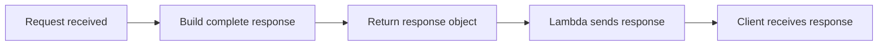
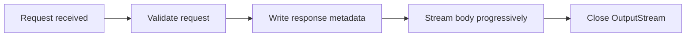

# Adding Response Streaming to a Kotlin Lambda behind API Gateway

### Implementing AWS Lambda Response Streaming for Kotlin and Java Without a Custom Runtime or Lambda Layers

## The problem

Most REST APIs return small JSON responses, which is still the most common use case. However, some APIs are exceptions to the rule – they return file downloads, bulk exports, or large generated payloads and use server-sent events to push data progressively to the client. With a growing number of AI APIs streaming responses token by token, what used to be an edge case is now becoming the expected behaviour.

I stumbled upon this problem with [MockNest Serverless](https://github.com/elenavanengelenmaslova/mocknest-serverless) [8], my open-source cloud mock server that runs in your AWS account. It exposes WireMock-compatible mock endpoints through API Gateway and AWS Lambda and persists mock definitions in S3. A mock server should be able to simulate the full behaviour of the APIs it replaces, including those that stream. A concrete example is Salesforce Bulk API 2.0 returns large CSV result sets from endpoints, such as `/services/data/vXX.X/jobs/query/{queryJobId}/results`, with locators and parallel result URLs for even larger sets [1]. If an application integrates with that kind of API, the mock needs to simulate large CSV downloads too. I needed to add this functionality in order to mock true streaming behaviour as well as increase the response size limit. API Gateway has a 10 MB payload limit for non-streaming APIs [2], but in the Lambda path the stricter limit is Lambda itself: synchronous invocation payloads are limited to 6 MB [3].

## Can AWS Lambda do it?

The short answer is **yes** - AWS Lambda introduced response payload streaming on April 7, 2023 [9], initially supporting Node.js 14.x, newer runtimes and custom runtimes, across 21 regions. The feature expanded to all commercial AWS regions on April 7, 2026 [10]. This capability increases the response payload limit from 6 MB to 200 MB.

## Does it work on the JVM?

ough the short answer is yes, there is a caveat. When I started implementing response streaming, the first thing I looked for was a Kotlin or Java library. AWS provides awslambda.HttpResponseStream.from() for Node.js, but I could not find an equivalent library or SDK for the AWS-managed JVM Lambda runtime. Most examples were written in JavaScript or TypeScript, while the official JVM guidance focused on custom runtimes and Lambda Layers rather than the managed Java runtime.

Rather than implementing the protocol directly inside MockNest Serverless, I extracted it into aws-lambda-streaming-core lightweight library [12] with no AWS SDK dependency. This article explains how that implementation works and lessons learnt along the way.

## Why response streaming is different

At a first glance, response streaming looks like a simple API change. Instead of returning an object, you write to it. However, in practice, it changes the entire lifecycle of a request. In the next few sections I will explain this life cycle, which is important if you want to implement Lambda Streaming on JVM without using layers or custom runtime.

### Buffered response

With a standard Lambda handler, the entire response is built in memory before anything is sent to the client.



This model is simple because the entire response exists before it is returned. If something goes wrong while generating the response, the handler can still change a `200 OK` into a `404` or `500`.

### Response streaming

In the case of response streaming, the client starts receiving data while your code is still producing it.



This seemingly small change has several important consequences:

- **The HTTP status is committed early.** Once the response metadata has been written, you cannot change a 200 OK into a 404 or 500 later on. Therefore, any validation that used to happen just before returning the response now needs to happen before streaming begins.

- **Memory usage becomes your responsibility.** Simply writing to an `OutputStream` does not automatically make your function memory efficient. If you first read a 100 MB file into a `ByteArray` and then write it to the stream, you've still allocated 100 MB of memory. In order to take advantage of the memory efficiency that streaming can give you, you need to stream from the source.

- **Flushing matters.** Writing bytes to an `OutputStream` does not necessarily mean the client receives them immediately - you need to flush explicitly.

- **Testing becomes more involved.** Unit tests can verify the protocol, and local integration tests with Floci or LocalStack can verify the handler and API Gateway configuration. Only a deployed AWS endpoint can prove that bytes are delivered progressively through the managed streaming path.

The implementation itself is not particularly complicated. The challenge is understanding the new lifecycle. Once that is clear, the next step is replacing the familiar `RequestHandler` with `RequestStreamHandler`.

## Moving to `RequestStreamHandler`

For most Java and Kotlin Lambda functions, the handler implements `RequestHandler`. AWS deserializes the incoming event into an object and expects another object in return:

```kotlin
class MyHandler : RequestHandler<APIGatewayProxyRequestEvent, APIGatewayProxyResponseEvent> {
    override fun handleRequest(
        request: APIGatewayProxyRequestEvent,
        context: Context,
    ): APIGatewayProxyResponseEvent {
        ...
    }
}
```

Response streaming requires a different interface:

```kotlin
class StreamingLambdaHandler : RequestStreamHandler {

    override fun handleRequest(
        input: InputStream,
        output: OutputStream,
        context: Context,
    ) {
        ...
    }
}
```

At first glance this looks like a small API change. In reality, it changes both sides of the request.

Instead of receiving an `APIGatewayProxyRequestEvent`, the request arrives as raw JSON through an `InputStream`. Likewise, instead of returning an `APIGatewayProxyResponseEvent`, the handler writes bytes directly to an `OutputStream`.

That means your handler becomes responsible for two things that AWS previously handled for you:

- parsing the API Gateway event from the input stream
- writing the HTTP response to the output stream

For MockNest Serverless, I wanted to keep the rest of the application unchanged. Rather than letting business logic work directly with the raw API Gateway event, I introduced a small parser that converts the incoming JSON into an internal HTTP request object. Everything beyond that point continues to work with the same abstractions as before.

On the response side, however, there is no equivalent abstraction provided by AWS for the JVM. Unlike the `Node.js` runtime, which exposes `awslambda.HttpResponseStream.from()` to handle the response protocol automatically [11], the `OutputStream` handed to a JVM `RequestStreamHandler` is just a raw stream. The library `aws-lambda-streaming-core` [12] helps you write your response to that stream correctly, so that AWS Lambda and API Gateway can interpret and return the streaming response correctly.

## Implementing the streaming protocol

Once the handler has switched to `RequestStreamHandler`, the next challenge is producing the response in the format that API Gateway expects.

This was the part that surprised me most. For Node.js, AWS provides `awslambda.HttpResponseStream.from()`, which hides the protocol completely [11]. On the JVM, however, the `OutputStream` is just a stream of bytes. The handler is responsible for writing the response exactly as API Gateway expects it.

The response consists of three parts:

1. Response metadata encoded as JSON
2. Eight null bytes (`0x00`) as a delimiter
3. The response body

Conceptually, the stream looks like this:

```text
+-------------------------------------------+
| Response metadata (JSON)                  |
+-------------------------------------------+
| 00 00 00 00 00 00 00 00                   |
+-------------------------------------------+
| Response body                             |
+-------------------------------------------+
```

Every JVM Lambda that implements response streaming has to produce this protocol. Rather than duplicating that logic across projects, I extracted it into **`aws-lambda-streaming-core`** [12].

The library exposes a small `ResponseWriter` responsible for writing the metadata prelude and delimiter:

```kotlin
val writer = ResponseWriter()

writer.writeMetadata(
    output,
    ResponseMetadata(
        statusCode = 200,
        headers = mapOf(
            "Content-Type" to "text/csv"
        )
    )
)
```

From that point onwards, the handler simply streams the body:

```kotlin
copy(source, output)
output.flush()
```

Internally, `ResponseWriter` serializes the response metadata to JSON, writes the required eight-byte delimiter, and commits the HTTP status before any body bytes are sent.

From that point onwards, the handler can simply stream the response body.

The implementation deliberately hides the protocol details, allowing the handler to focus on the application itself rather than the response format expected by API Gateway.

## Step 1: Move from `RequestHandler` to `RequestStreamHandler`

The usual Java/Kotlin Lambda handler often looks like this:

```kotlin
RequestHandler<APIGatewayProxyRequestEvent, APIGatewayProxyResponseEvent>
```

That model is convenient. AWS gives you a request object, and you return a response object.

For response streaming, I refactored the handler to implement `RequestStreamHandler` from `aws-lambda-java-core`:

```kotlin
class StreamingLambdaHandler : RequestStreamHandler {
    override fun handleRequest(
        input: InputStream,
        output: OutputStream,
        context: Context
    ) {
        // parse request from input
        // write streamed response to output
    }
}
```

This is the first change. Lambda handler is no longer returning an `APIGatewayProxyResponseEvent`, instead it is writing bytes.

The request still arrives as an API Gateway proxy event, but now it arrives through the raw `InputStream`. That means a lambda handler needs to parse the JSON, including method, path, headers, query parameters, body, and base64 encoding if your API uses it.

For request handling, I added a small parser that converts the raw API Gateway event into domain-level HTTP request object. That kept the rest of the application code unchanged.

The response side is where things get more interesting.

## Step 2: Write the API Gateway streaming response format

For API Gateway response streaming, the Lambda output stream must contain three parts:

1. response metadata as JSON
2. eight null bytes as a delimiter
3. the response body bytes

Conceptually:

```text
{"statusCode":200,"headers":{"Content-Type":"text/csv"}}
<8 null bytes>
body bytes...
```

A simplified Kotlin writer looks like this:

```kotlin
@Serializable
data class ResponseMetadata(
    val statusCode: Int,
    val headers: Map<String, String>
)

private fun writeMetadata(
    output: OutputStream,
    statusCode: Int,
    headers: Map<String, String>
) {
    val metadata = ResponseMetadata(
        statusCode = statusCode,
        headers = headers
    )

    val json = Json.encodeToString(metadata).encodeToByteArray()

    output.write(json)
    output.write(ByteArray(8))
    output.flush()
}
```

You can use your JSON library of choice. In my project, Kotlinx Serialization is preferred.

There was one issue I encountered was with the headers. HTTP allows a header to appear more than once, `Set-Cookie` is the common case, but the API Gateway streaming metadata format requires plain string values in the `headers` map, not arrays. If you serialize headers as `Map<String, List<String>>` (JSON arrays for values), API Gateway rejects the response with HTTP 502. For repeated headers like `Set-Cookie`, use the separate `cookies` array field that the streaming metadata format provides. For other multi-value headers, use the separate `multiValueHeaders` field, which accepts `Map<String, List<String>>` [9].

After the metadata and delimiter are written, the body can be written progressively:

```kotlin
writeMetadata(
    output = output,
    statusCode = 200,
    headers = mapOf("Content-Type" to "text/csv")
)

sourceInputStream.copyTo(output)
output.flush()
```

This is where JVM streaming feels lower-level than many examples. The Lambda handler is not only producing the body. It is producing the response protocol that API Gateway expects.

## Step 3: Enable streaming in API Gateway

Next, API Gateway also has to invoke the Lambda through the streaming path.

API Gateway response streaming is supported for REST APIs with proxy integrations [5]. AWS also has a good Compute Blog walkthrough covering the API Gateway side of the streaming feature [7]. Note that request streaming is not supported, only response streaming.

MockNest Serverless uses AWS SAM, so the API event needed response streaming enabled:

```yaml
Events:
  MockApi:
    Type: Api
    Properties:
      Path: /{proxy+}
      Method: ANY
      ResponseTransferMode: RESPONSE_STREAM
```

This naming is slightly confusing.

In AWS SAM `Api` events, the value is `RESPONSE_STREAM` [6]. In lower-level API Gateway integration configuration, the response transfer mode is `STREAM` [5]:

```yaml
Uri: !Sub arn:aws:apigateway:${AWS::Region}:lambda:path/2021-11-15/functions/${FunctionArn}/response-streaming-invocations
```

That `/response-streaming-invocations` suffix tells API Gateway to use the Lambda streaming invocation API.

## Step 4: Stream from the real source

For a demo, you can stream a small in-memory string:

```kotlin
output.write("hello".toByteArray())
output.flush()
Thread.sleep(1000)

output.write(" world".toByteArray())
output.flush()
```

The sleep only makes the two writes observable. It proves that bytes can be flushed in separate chunks, but it does not solve the real memory problem.

If your goal is to return a 50 MB CSV file, this is not enough:

```kotlin
val bytes = file.readBytes()
output.write(bytes)
```

That still loads the full response into memory. You may have response streaming at the Lambda/API Gateway boundary, but your function is still buffering internally.

The better pattern is to stream from the source directly. The source could be S3, a database cursor, a generated CSV writer, or another HTTP response.

For example, in MockNest Serverless, S3 objects are streamed through a fixed-size buffer directly to the output stream:

```kotlin
const val BUFFER_SIZE = 1_048_576 // 1 MB

fun copy(source: InputStream, sink: OutputStream, flush: () -> Unit): Long {
    val buffer = ByteArray(BUFFER_SIZE)
    var total = 0L
    while (true) {
        val read = source.read(buffer)
        if (read < 0) break
        sink.write(buffer, 0, read)
        flush()
        total += read
    }
    flush()
    return total
}
```

The S3 response body is obtained as an `InputStream` and passed directly to `copy`:

```kotlin
suspend fun streamBody(key: String, sink: OutputStream, flush: () -> Unit): Long {
    val request = GetObjectRequest {
        bucket = this@S3Source.bucket
        this.key = key
    }
    return client.getObject(request) { response ->
        val body = checkNotNull(response.body) { "S3 getObject returned an empty body" }
        body.toInputStream().use { source ->
            copy(source, sink, flush)
        }
    }
}
```

The exact buffer size depends on your workload. The important part is that memory usage is bounded. A 10 MB response, a 50 MB response, and a 150 MB response should not require the function to hold the whole body in memory.

In MockNest Serverless, some response bodies are stored in S3, so the Lambda streams the S3 object to the API Gateway output stream. In another application, the same idea could apply to generated reports, CSV exports, AI output, or file transformations.

The rule is the same: do not turn the response into a `String` or `ByteArray` unless you are sure it is small enough.

## Step 5: Validate before committing the status code

Streaming changes error handling.

With a buffered response, you can build the whole response first and only then decide whether to return `200`, `404`, or `500`.

With streaming, the metadata comes first.

Once you write this:

```json
{"statusCode":200}
```

followed by the eight null bytes, the client has effectively received a `200` response. If your source fails halfway through the body, you cannot go back and turn that response into a clean `500`.

That means some validation must move earlier.

For an S3-backed response, check that the object exists and check its size before writing the response metadata. For a generated CSV, validate the input parameters before writing headers. For a database-backed response, make sure the query can start before committing the HTTP status.

The general pattern is:

```kotlin
validateSourceBeforeStreaming()

writeMetadata(output, 200, headers)

streamBody(output)
```

This does not solve every possible failure. A network error can still happen halfway through a stream. But it avoids the most avoidable case: returning a successful status before discovering that there is no body to stream.

## Step 6: Flush deliberately

For slow responses or SSE-like behaviour, flushing matters.

Writing to an `OutputStream` does not always mean the client immediately receives the bytes. If you want the client to observe progressive delivery, flush after each chunk:

```kotlin
chunks.forEachIndexed { index, chunk ->
    if (index > 0) {
        delay(delayBetweenChunks)
    }

    output.write(chunk)
    output.flush()
}
```

This is especially important when you are testing whether the endpoint really streams. Without flushing, your application code may look like it writes progressively, while the client still receives data later than expected.

You also need to keep idle timeouts in mind. API Gateway response streams are still subject to idle timeouts. For Regional and private endpoints, the idle timeout is 5 minutes. For edge-optimized endpoints, it is 30 seconds [5].

So if you simulate a slow stream, make sure the gap between chunks stays below the relevant idle timeout.

## Step 7: Test it in layers

Testing response streaming is tricky because different tests prove different things.

A unit test can prove that your writer produces the right bytes. An integration test can prove that your handler can return a large payload. But neither of those proves that the deployed API Gateway endpoint sends bytes progressively to a real HTTP client.

So I tested the feature in three layers.

### Unit and property tests

At the lowest level, I tested the mechanics that should be deterministic:

* the streaming protocol writer
* the API Gateway request parser
* chunk size calculation
* delayed chunk writing
* bounded-buffer streaming
* routing preservation after switching to `RequestStreamHandler`

The most important test was the protocol round-trip. For a range of responses, the writer produced:

1. metadata
2. eight null bytes
3. body bytes

The test then parsed the result back and verified that the status code, headers, and body were preserved byte-for-byte.

I also tested larger bodies at this layer. Not because a unit test proves platform streaming, but because it proves my own writer does not corrupt the stream when the body is larger than the old 6 MB limit.

For streaming from a source, I tested a different property: the output must be byte-identical to the input, and the buffer allocation must stay bounded. In my case, the buffer was 1 MB. That means a large response can grow from 7 MB to 50 MB without requiring a 50 MB in-memory byte array.

Those tests answer the question:

> Does my JVM code write the correct stream without loading the whole response into memory?

They do not answer:

> Does the deployed API actually stream to the client?

That needs a different test.

### Integration tests

The next layer tested the handler and the runtime path more realistically.

For MockNest Serverless, that meant registering a mock, invoking it through the local or test runtime path, and checking the response. For another application, it could mean generating a CSV, reading from S3, or streaming from a database cursor.

I used integration tests to cover both sides of the original limit:

* a normal response below 6 MB
* a large response above 6 MB

That distinction matters. A streaming implementation that only works for small payloads can hide the exact problem you are trying to solve.

For the large payload test, I generated a response larger than 6 MB and verified the received byte length and content. That proves the implementation can carry a response that would not fit in the old buffered Lambda response model.

I also tested delayed delivery. For a response configured to be split into chunks over a duration, the test verified that the total elapsed time was in the expected range. This does not prove real network streaming through API Gateway, but it does prove that the handler writes chunks with delays instead of writing the whole body immediately.

These tests answer the question:

> Can the handler produce large and delayed responses correctly?

They still do not fully answer:

> Does the deployed API Gateway endpoint send the first bytes early?

That final question needs a deployed test.

### Post-deploy tests

The last test runs after deployment against the real API endpoint.

This is the one that proves the infrastructure is wired correctly.

Before measuring, run a warmup request first. A cold start introduces a delay that would dominate the first-byte timing and make a correctly configured streaming endpoint look slow. The warmup request brings the Lambda to a warm state so the subsequent measurements reflect streaming latency, not initialization time.

I used two checks.

The first check verifies a payload larger than 6 MB. The test creates a response above the buffered Lambda limit, calls the deployed endpoint, and verifies that the received payload has the expected size. If this fails, either streaming is not enabled correctly or something still buffers through the old limit.

The second check verifies progressive delivery.

The method is simple: call an endpoint that intentionally sends a slow response, measure when the first byte arrives, and compare that with the total response time.

If streaming works, the first byte arrives much earlier than the full response completes.

If something buffers the response, the first byte and the full response arrive at almost the same time.

That measurement is important because a response can be “successful” without being streamed. You might get the correct body eventually, but if it arrives all at once, your endpoint is still buffered from the client’s point of view.

This is also the check that catches a subtler problem: the managed runtime itself may not stream. Switching to `RequestStreamHandler` and setting `RESPONSE_STREAM` are necessary, but they do not guarantee that every layer in between flushes bytes as they are written rather than buffering the whole response first. The only way to know is to measure first-byte timing against a real deployed endpoint. If the bytes still arrive all at once after everything is wired correctly, that is a signal to look at the runtime and integration path, not your handler code.

These post-deploy tests answer the question:

> Does the deployed API behave like a streaming endpoint from the client’s perspective?

That is the test local code cannot replace.

## Using the library

The wire protocol from Step 2 and the bounded-buffer streaming from Step 4 are published as `aws-lambda-streaming-core` [12]:

```kotlin
implementation("nl.vintik:aws-lambda-streaming-core:2.0.0")
```

Its only dependency is `kotlinx-serialization-json`, for encoding the metadata prelude. There are no AWS artifacts — the module implements the wire format and never touches the Lambda or S3 APIs, so you bring your own `aws-lambda-java-core` for the `RequestStreamHandler` interface and whatever SDK you stream the source from. It is compiled for Java 21, so it runs on the `java21` and `java25` Lambda runtimes alike.

The library gives you two pieces, mapping directly onto the two hard parts above:

- **`ResponseWriter`** — encodes the protocol from Step 2. It serializes a `ResponseMetadata` (status code, headers, optional cookies) and writes the eight null-byte delimiter before any body bytes. Once `writeMetadata` returns, the status is committed, so a later failure can only truncate the body, never rewrite the status (Step 5).
- **`copy(source, sink)`** — the 1 MB bounded copy from Step 4, so a large body streams through a fixed buffer with per-chunk flush instead of being materialized in memory.

You still implement `RequestStreamHandler` yourself and drive these from it:

```kotlin
class MyHandler : RequestStreamHandler {
    private val writer = ResponseWriter()

    override fun handleRequest(input: InputStream, output: OutputStream, context: Context) {
        output.use {
            val request = parseRequest(input)              // your event parsing + validation
            if (request == null) {
                writer.writeError(output, 400, "The request could not be parsed.")
                return@use
            }

            // validate the source before committing the status (Step 5)
            request.openStream().use { source ->
                writer.writeMetadata(output, ResponseMetadata(
                    statusCode = 200,
                    headers = mapOf(
                        "Content-Type" to "application/octet-stream",
                        "Content-Length" to request.contentLength.toString(),
                    ),
                ))
                // status is committed — stream the body through the bounded buffer
                copy(source, output)
                output.flush()
            }
        }
    }
}
```

The prelude models `headers` as name → single value, so for repeated headers `ResponseMetadata.fromMultiValue(status, headers)` collapses a `Map<String, List<String>>` — joining values with `", "` and routing `Set-Cookie` to the dedicated `cookies` array so cookies are never comma-corrupted. (The AWS format also allows a `multiValueHeaders` field, as noted in Step 2; the library deliberately does not model it, keeping the metadata to single-value `headers` plus `cookies`.) If you would rather fail fast than let an oversized prelude reach the runtime, construct the writer with `ResponseWriter(maxPreludeLen = OBSERVED_MAX_PRELUDE_LEN)`: it then raises `MetadataTooLargeException` before writing anything, while the status is still uncommitted.

### Optional: the higher-level scaffolding in the example module

The companion `streaming-s3-example` module [12] goes one step further and factors a handler into small, independently testable interfaces. These are *example* code, not part of the published artifact — deliberately so, since `S3Source` would drag the full AWS S3 Kotlin SDK onto every consumer — but they are short enough to copy and adapt:

- **`RequestResolver<R>`** — reads the Lambda `InputStream` and returns either a typed request (`RequestResult.Resolved`) or an error status (`RequestResult.Error`). This is where event parsing and input validation live.
- **`StreamSource<R>`** — `head(request)` confirms the resource exists and returns its size for `Content-Length`; `streamBody(request, sink, flush)` then copies the bytes. Any backing store can implement it.
- **`StreamHandler<R>`** — the `RequestStreamHandler` that wires the two together and owns the ordering rules: resolve, head-before-commit, write metadata, stream body.

```kotlin
// S3-backed handler using the example module's FileKeyResolver + S3Source
class S3Handler : RequestStreamHandler {
    private val handler = StreamHandler(
        requestResolver = ::FileKeyResolver,
        source = ::S3Source,
    )

    override fun handleRequest(input: InputStream, output: OutputStream, context: Context) =
        handler.handleRequest(input, output, context)
}
```

`FileKeyResolver` (proxy-path parsing plus file-name validation) and `S3Source` (`headObject` + `getObject` via the AWS S3 Kotlin SDK) live in the example module as working references.

## What changed in MockNest Serverless

Once the protocol was proven here, MockNest Serverless adopted the published library directly. Its AWS core module depends on `nl.vintik:aws-lambda-streaming-core:2.0.0`, and the streaming Lambda handler (`StreamingRuntimeLambdaHandler`) drives it:

* the metadata prelude and delimiter are written by `ResponseWriter`, constructed as `ResponseWriter(maxPreludeLen = OBSERVED_MAX_PRELUDE_LEN)` so an oversized prelude fails fast instead of reaching the runtime
* response headers are built with `ResponseMetadata.fromMultiValue(...)`, so multi-value headers and `Set-Cookie` are collapsed correctly
* the S3 body is copied to the output stream through the library's `copy(...)` bounded buffer inside `S3ResponseStreamer`

What stayed inside MockNest is what is specific to MockNest: the API Gateway request parser, the admin/client/health routing, and a chunked "dribble" writer that simulates slow, SSE-style delivery. The library covers the parts that are identical for any streaming JVM Lambda — encoding the wire protocol and copying the body with bounded memory — and leaves the application-specific pieces to the consumer.

That split is why the pattern is useful beyond this project. MockNest Serverless gave me the real use case, but the mechanics apply to any Java or Kotlin Lambda that needs to return larger or progressively delivered HTTP responses.

## Lessons learned

The first lesson is that response streaming is not just a handler change. The Lambda handler, response protocol, API Gateway integration, infrastructure configuration, and tests all need to agree.

The second lesson is that JVM developers need to be aware of the response format. In the JavaScript examples, AWS helpers hide the metadata and delimiter. With a Kotlin `RequestStreamHandler`, you may need to write that protocol yourself.

The third lesson is that streaming at the platform boundary does not automatically make your code memory-efficient. If you load the full file into memory and then write it to the output stream, you have increased the response limit, but you have not fixed the memory profile.

The fourth lesson is that the HTTP status code is committed early. Validate what you can before writing metadata.

The fifth lesson is that testing has to be layered. Unit tests prove byte correctness. Integration tests prove the handler can produce large and delayed responses. Post-deploy tests prove that the real API endpoint streams progressively.

And finally, naming matters. The `STREAM` and `RESPONSE_STREAM` distinction is not theoretical. It is the kind of small infrastructure detail that can make correct application code look broken after deployment.

## Conclusion

Adding response streaming to a Kotlin Lambda was worth it, but it was not a one-line change.

For JVM Lambdas behind API Gateway, the practical path is:

1. use `RequestStreamHandler`
2. parse the incoming API Gateway event from `InputStream`
3. write response metadata, eight null bytes, and then body bytes to `OutputStream`
4. enable response streaming in API Gateway or SAM
5. stream from the real source instead of buffering into memory
6. flush deliberately
7. test at three levels: protocol, handler, and deployed endpoint

The important part is not only getting past the 6 MB response limit.

The important part is making the whole path behave like streaming.

Do not stop when the code writes to an `OutputStream`.

Stop when a payload larger than 6 MB succeeds, the first byte arrives early, and your Lambda memory usage does not grow with the response size.

The full source is open source on GitHub [8]. If you want to see the handler, the protocol writer, and the layered tests in context, that is the place to start.

## References

[1] Salesforce Bulk API 2.0 and Bulk API Developer Guide
https://resources.docs.salesforce.com/latest/latest/en-us/sfdc/pdf/api_asynch.pdf

[2] Amazon API Gateway quotas
https://docs.aws.amazon.com/general/latest/gr/apigateway.html

[3] AWS Lambda quotas
https://docs.aws.amazon.com/lambda/latest/dg/gettingstarted-limits.html

[4] AWS Lambda documentation — Response streaming for Lambda functions
https://docs.aws.amazon.com/lambda/latest/dg/configuration-response-streaming.html

[5] API Gateway documentation — Stream the integration response for proxy integrations
https://docs.aws.amazon.com/apigateway/latest/developerguide/response-transfer-mode.html

[6] AWS SAM documentation — Api event source `ResponseTransferMode`
https://docs.aws.amazon.com/serverless-application-model/latest/developerguide/sam-property-function-api.html

[7] AWS Compute Blog — Building responsive APIs with Amazon API Gateway response streaming
https://aws.amazon.com/blogs/compute/building-responsive-apis-with-amazon-api-gateway-response-streaming/

[8] MockNest Serverless repository
https://github.com/elenavanengelenmaslova/mocknest-serverless

[9] API Gateway documentation — Lambda proxy integration format for response streaming
https://docs.aws.amazon.com/apigateway/latest/developerguide/response-transfer-mode-lambda.html

[10] AWS What's New — AWS Lambda response payload streaming (April 7, 2023)
https://aws.amazon.com/about-aws/whats-new/2023/04/aws-lambda-response-payload-streaming/

[11] AWS What's New — AWS Lambda response streaming expands to all commercial AWS regions (April 7, 2026)
https://aws.amazon.com/about-aws/whats-new/2026/04/aws-lambda-response-streaming/

[12] aws-lambda-streaming-core — source, README, and the `streaming-s3-example` module (GitHub); published to Maven Central as `nl.vintik:aws-lambda-streaming-core`
https://github.com/elenavanengelenmaslova/aws-lambda-streaming-jvm-runtime

[13] Introducing AWS Lambda response streaming https://aws.amazon.com/blogs/compute/introducing-aws-lambda-response-streaming/
