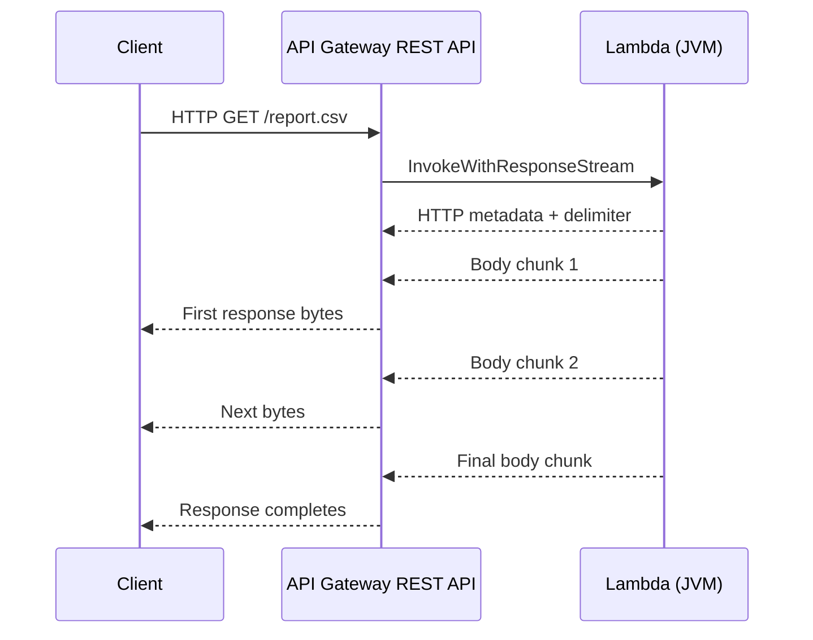

# AWS Lambda Response Streaming for Kotlin and Java

*Implementing HTTP response streaming behind API Gateway without writing a custom JVM runtime or adding Lambda layers.*

When an HTTP endpoint returns a small JSON document, buffering the response is usually fine. But what if the endpoint returns a large CSV export, sends an AI-generated answer progressively, or reports progress over time?

**Response streaming** lets the server begin sending bytes before the entire response has been produced. This improves *time to first byte* (TTFB), and when the data is read and written in chunks, it avoids keeping the complete response in memory. AWS Lambda supports streamed response payloads up to **200 MB**, compared with **6 MB** for a buffered synchronous Lambda response [1].

## Streaming and Server-Sent Events

A buffered endpoint prepares the complete response and then sends it. A streaming endpoint sends chunks as they become available:

```text
Buffered:  [ generate entire response ........ ] [ client receives response ]
Streaming: [ chunk 1 ][ chunk 2 ][ chunk 3 ]
Client:    [ chunk 1 ][ chunk 2 ][ chunk 3 ]
```

Common uses include large file downloads, CSV exports, generated reports, progressive AI output, and progress notifications.

**Server-Sent Events (SSE)** is one application of HTTP streaming. An SSE endpoint uses the `text/event-stream` content type and keeps sending text-formatted events over a single HTTP response:

```text
data: processing started

data: 50% complete

data: finished

```

Unlike WebSockets, SSE is a one-way channel from server to client. It fits progress updates and streamed output when the client does not need a bidirectional connection. API Gateway lists SSE and AI responses among the use cases for response streaming [2].

## How Lambda and API Gateway stream a response

With a buffered Lambda integration, API Gateway waits for the response to finish. With response streaming enabled on a **REST API proxy integration**, API Gateway invokes Lambda using `InvokeWithResponseStream` and forwards the response progressively [1, 2].



The integration response contains three parts, in order [3]:

```text
[HTTP response metadata as JSON]
[8 zero bytes]
[response body bytes, written progressively]
```

The metadata carries information such as the HTTP status and headers. The eight zero bytes mark the boundary between metadata and body. This is **response** streaming: API Gateway does not support request-body streaming in this mode [2].

Configuration also matters. At the API Gateway integration level the response transfer mode is `STREAM` [2]. When using AWS SAM, the corresponding `Api` event property is **`RESPONSE_STREAM`** [4]:

```yaml
Events:
  StreamGet:
    Type: Api
    Properties:
      RestApiId: !Ref StreamingApi
      Path: /{proxy+}
      Method: get
      ResponseTransferMode: RESPONSE_STREAM
```

This is the setting used by the Kotlin S3 example in the repository [8].

## Node.js already has helpers

The Lambda-managed Node.js runtime provides `awslambda.streamifyResponse()` for streaming handlers and `awslambda.HttpResponseStream.from()` to attach HTTP metadata to the streamed response [3, 5]:

```javascript
export const handler = awslambda.streamifyResponse(async (event, responseStream) => {
    responseStream = awslambda.HttpResponseStream.from(responseStream, {
        statusCode: 200,
        headers: { "Content-Type": "text/plain" }
    });

    responseStream.write("First chunk\n");
    responseStream.write("Second chunk\n");
    responseStream.end();
});
```

These APIs are provided by the **Node.js Lambda runtime**, not by a separate TypeScript SDK package. The helper handles the response framing, so the handler does not have to manually write the delimiter. For piping data from another stream, AWS recommends Node.js `pipeline()` to manage backpressure [5].

## The gap for Java and Kotlin

AWS documents managed-runtime response streaming for **Node.js**. For other languages, its Lambda documentation directs developers toward a custom runtime using the Runtime API or the Lambda Web Adapter [1]. AWS does not provide a corresponding managed JVM helper such as `HttpResponseStream.from()`.

A Java or Kotlin Lambda can implement AWS's `RequestStreamHandler` and write to its `OutputStream`, but the application still needs to produce the expected API Gateway streaming response format. Otherwise, there is protocol handling to recreate in each project.

I encountered this while building **MockNest Serverless**, an open-source API mocking platform running on API Gateway and Lambda. It needed to return large mock response bodies and support progressive delivery. Rather than keep the framing and bounded-copy logic inside MockNest, I extracted that functionality into a reusable library [6, 7].

## Introducing `aws-lambda-streaming-core`

[`aws-lambda-streaming-core`](https://github.com/elenavanengelenmaslova/aws-lambda-streaming-jvm-runtime) is a JVM library for Java and Kotlin applications using Lambda and API Gateway response streaming [6]. It focuses on two responsibilities:

- **Correct response framing.** `ResponseWriter` serializes `ResponseMetadata`, writes the eight-byte delimiter, and provides helpers for complete responses and JSON error responses. `ResponseMetadata.fromMultiValue()` also handles repeated headers, placing `Set-Cookie` values in the dedicated `cookies` field.
- **Bounded-memory transfer.** `copy(source, sink)` reuses a fixed **1 MiB** buffer and flushes after each written chunk, rather than loading the entire response into a `String` or `ByteArray`.

The core module only implements the streaming protocol and byte-copying utilities. It does not depend on the AWS SDK, select an S3 object, parse your application request, or provision API Gateway. Those remain the application's responsibilities [6].

## Using the library

Add the dependency from Maven Central [6]:

```kotlin
implementation("nl.vintik:aws-lambda-streaming-core:2.1.0")
```

Your Lambda still implements `RequestStreamHandler`. The key part of the Kotlin S3 example is a **head-before-stream** sequence: validate the request, check that the S3 object exists and obtain its size, write response metadata, then stream the S3 body.

The following excerpt is adapted from the repository's Kotlin `StreamHandler` and `S3Source` separation [8]:

```kotlin
val metadata = ResponseMetadata(
    statusCode = 200,
    headers = mapOf(
        "Content-Type" to "application/octet-stream",
        "Content-Length" to size.toString(),
    ),
)

responseWriter.writeMetadata(output, metadata)
// The status is now committed.
source.streamBody(request, output) { output.flush() }
```

The application-specific `source.streamBody(...)` reads from S3. Inside that implementation, the library's `copy()` transfers the bytes through the fixed buffer. For an arbitrary `InputStream`, the core operation looks like this:

```kotlin
responseWriter.writeMetadata(output, metadata)
sourceInputStream.use { source ->
    copy(source, output)
}
```

The corresponding Java example uses `ResponseWriter`, `ResponseMetadata` and the Java-callable `BoundedBufferKt.copy(...)` function [9].

**One important rule:** validate before `writeMetadata()`. After metadata and the delimiter have been written, HTTP 200 cannot be changed to HTTP 404 or 500 if the body fails halfway through. The S3 examples check the object's existence and size first. If a body read fails later, the error propagates and the body may be truncated [8, 9].

The repository contains two complete, deployable examples:

- **[Kotlin S3 example](https://github.com/elenavanengelenmaslova/aws-lambda-streaming-jvm-runtime/tree/main/streaming-s3-example)** — Kotlin AWS SDK, coroutine-based S3 access, Lambda `RequestStreamHandler`, and AWS SAM deployment [8].
- **[Java S3 example](https://github.com/elenavanengelenmaslova/aws-lambda-streaming-jvm-runtime/tree/main/streaming-s3-example-java)** — AWS SDK for Java v2, synchronous S3 access, the same core library, and a separate SAM deployment [9].

Both show more than the library call: request validation, S3 existence checks, HTTP errors, API Gateway configuration, and tests around large responses. The Kotlin example also includes a post-deployment check measuring time to first byte and verifying downloaded file contents [8].

## Used in MockNest Serverless

The library originated in [MockNest Serverless](https://github.com/elenavanengelenmaslova/mocknest-serverless), my open-source serverless API mocking platform [7]. Some API mocks need to imitate large downloads; others must deliver responses gradually rather than return a single buffered body.

MockNest uses the extracted response-writing and bounded-streaming functionality instead of maintaining a separate copy of the API Gateway protocol. The same library is available to any JVM Lambda that needs to return large or progressively delivered responses [6, 7].

If you want the implementation details, deployment configuration and tests, start with the **[library repository](https://github.com/elenavanengelenmaslova/aws-lambda-streaming-jvm-runtime)** and its Kotlin and Java S3 examples.

## References

[1] AWS Lambda — Response streaming for Lambda functions. https://docs.aws.amazon.com/lambda/latest/dg/configuration-response-streaming.html

[2] Amazon API Gateway — Stream the integration response for your proxy integrations. https://docs.aws.amazon.com/apigateway/latest/developerguide/response-transfer-mode.html

[3] Amazon API Gateway — Configure a Lambda proxy integration with payload response streaming. https://docs.aws.amazon.com/apigateway/latest/developerguide/response-streaming-lambda-configure.html

[4] AWS SAM — `Api` event source: `ResponseTransferMode`. https://docs.aws.amazon.com/serverless-application-model/latest/developerguide/sam-property-function-api.html

[5] AWS Lambda — Writing response streaming-enabled Lambda functions. https://docs.aws.amazon.com/lambda/latest/dg/config-rs-write-functions.html

[6] `aws-lambda-streaming-core` — JVM library, source and README. https://github.com/elenavanengelenmaslova/aws-lambda-streaming-jvm-runtime

[7] MockNest Serverless — GitHub repository. https://github.com/elenavanengelenmaslova/mocknest-serverless

[8] Kotlin S3 streaming example — Code, SAM template and deployment tests. https://github.com/elenavanengelenmaslova/aws-lambda-streaming-jvm-runtime/tree/main/streaming-s3-example

[9] Java S3 streaming example — Code and SAM deployment. https://github.com/elenavanengelenmaslova/aws-lambda-streaming-jvm-runtime/tree/main/streaming-s3-example-java
